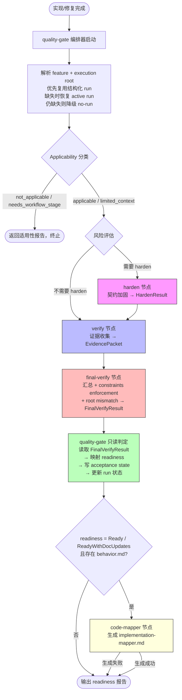

# Plan: openflow-harden-quality-gate-final-verify-code-mapper

## Overview

将 quality-gate 从 1700 行单体编排器拆为独立节点链：harden 独立节点、verify 证据收集节点、新增 final-verify 汇总节点、code-mapper 独立节点；quality-gate 收敛为只读 readiness 判定节点。节点编排顺序：applicability → risk → harden? → verify → final-verify → quality-gate(read-only) → mapper?。所有现有 acceptance-state 字段语义保持向后兼容。

## Design Context

- 设计文档：`docs/changes/2026-05-27-openflow-harden-quality-gate-final-verify-code-mapper/design.md`
- 行为文档：`docs/changes/2026-05-27-openflow-harden-quality-gate-final-verify-code-mapper/behavior.md`
- 状态文件：`docs/changes/2026-05-27-openflow-harden-quality-gate-final-verify-code-mapper/state.md`
- workflow 同步草案：`docs/changes/2026-05-27-openflow-harden-quality-gate-final-verify-code-mapper/workflow-sync-draft.md`

### 约束（来自 state.md C1–C10）

- C1: quality-gate 不得直接调用 handleHarden() 或 handleVerify()
- C2: final-verify 是 constraints enforcement 的唯一点
- C3: code-mapper 生成失败不阻断 readiness
- C4: 节点编排顺序不可跳过
- C5: 所有现有 acceptance-state 字段语义保持向后兼容
- C6: harden 独立后仍由 quality-gate 编排器按风险触发
- C7: execution root mismatch 强制 NotReady
- C8: constraints 证据必须是命令输出
- C9: limited_context 不得升级为完整 archive readiness
- C10: quality-gate 优先复用当前调用链的结构化 ImplementationRun，仅在缺失时才恢复 active run

### 不变量（I1–I8）

- I1: execution root mismatch 强制 NotReady
- I2: Applicability 分类语义不变
- I3: harden 不能通过改文档解决契约分歧
- I4: 约束验证证据必须是命令输出
- I5: implementation-mapper 仅在 Ready/ReadyWithDocUpdates 且存在 behavior.md 时生成
- I6: quality-gate 不自动归档
- I7: limited_context 不得升级为完整 archive readiness
- I8: harden 的 finding 类型集不变

## Pyramid + TDD Strategy

### 最高目标

quality-gate 成为只读 readiness 判定节点，所有主动验证和 enforcement 分布在独立可测试的节点链中。

### 任务金字塔

```
1. 节点链重构
   1.1 创建 final-verify 节点（新增）
   1.2 code-mapper 独立化（提取）
   1.3 quality-gate 只读化（重构主体）
2. 质量保障
   2.1 集成测试覆盖 10 个行为场景 + 8 个不变量
3. 文档同步
   3.1 implementation-constraints 文档对齐
   3.2 workflow 同步草案维护
   3.3 current workflow 文档更新
```

### 节点编排流程图



### 核心抽象与边界

| 抽象 | 职责 | 边界 |
|------|------|------|
| final-verify | 汇总 verify evidence + harden result + constraints enforcement + root mismatch → readiness_recommendation | 不执行 harden，不执行 verify，不写 acceptance state |
| verify | 收集技术证据 → evidence packet | 不做 readiness 判定，不做 constraints enforcement |
| harden | 契约加固 → harden result | 不改文档，不直接修改 acceptance state |
| code-mapper | 生成 implementation-mapper.md | 仅在 Ready/ReadyWithDocUpdates + behavior.md 存在时触发 |
| quality-gate | 优先复用结构化 ImplementationRun；缺失时恢复 active run；读取 final-verify result → 写 acceptance state + 输出报告 | 不把 LLM 会话计划上下文当作 execution root / run status authority |

### TDD 驱动顺序

1. **RED**：为 final-verify 写失败测试（汇总逻辑、constraints enforcement、root mismatch）
2. **GREEN**：实现 final-verify 节点使测试通过
3. **RED**：为 quality-gate 只读行为写失败测试（不调用 handleHarden/handleVerify）
4. **GREEN**：重构 quality-gate 编排器使测试通过
5. **REFACTOR**：提取 code-mapper 独立调用路径，清理接口，确保现有测试全绿

## Execution Strategy

### Parallel Execution Waves

**Wave 1**（无依赖，可并行）：
- Task 1: 创建 final-verify 节点
- Task 2: code-mapper 独立化

**Wave 2**（依赖 Wave 1）：
- Task 3: 重构 quality-gate 编排器

**Wave 3**（依赖 Wave 2，可并行）：
- Task 4: 集成测试
- Task 5: 更新 implementation-constraints 文档
- Task 6: 维护 workflow 同步草案并更新 current workflow 文档

### Dependency Matrix

| Task | Blocked By | Blocks |
|------|-----------|--------|
| 1. final-verify 节点 | — | 3, 4 |
| 2. code-mapper 独立化 | — | 3, 4 |
| 3. quality-gate 只读化 | 1, 2 | 4, 5, 6 |
| 4. 集成测试 | 1, 2, 3 | — |
| 5. implementation-constraints 文档 | 3 | — |
| 6. workflow 同步草案 + current workflow 文档更新 | 3 | — |

## Tasks

- [ ] 1. 创建 final-verify 节点 (Agent: fixer | Blocks: [3, 4] | Blocked By: [])
  - **新增文件**: `src/commands/final-verify.ts`
  - **修改文件**: `src/types.ts`（添加 FinalVerifyResult 类型）
  - **复用文件**: `src/commands/constraint-verifier.ts`（已有 `verifyConstraintSatisfaction()` 和 `ConstraintVerificationResult`，final-verify 直接导入复用，不新建重复类型）
  - **类型定义**:
    ```typescript
    interface FinalVerifyResult {
      readinessRecommendation: VerifyReadinessStatus  // Ready / ReadyWithDocUpdates / NotReady / NeedsDecision
      constraintSatisfaction: ConstraintVerificationResult['status']  // 复用 'satisfied' | 'blocked' | 'skipped'
      rootMismatch: boolean
      behaviorCoverage: string
      constraintBlockReasons?: string[]
    }
    ```
  - **实现内容**:
    - 读取 verify evidence packet（从 acceptance-state 或中间结果）
    - 读取 harden result（如有）
    - 执行 constraints enforcement：调用 `verifyConstraintSatisfaction()`（从 `constraint-verifier.ts` 导入，该文件注释已标注 "Transitional path — this will migrate to final-verify"）— C2, C8
    - 检查 execution root mismatch — C7
    - 评估 behavior scenario 覆盖
    - 产出 FinalVerifyResult
  - **测试文件**: `tests/commands/final-verify.test.ts`（新增）
  - **TDD**:
    - RED: 测试 constraints enforcement 阻断场景（blocking constraint 无命令输出 → blocked）
    - RED: 测试 root mismatch 场景（root 不匹配 → NotReady）
    - RED: 测试汇总场景（verify 通过 + harden 通过 + 无约束 → Ready）
    - GREEN: 实现 final-verify 使三个测试通过
    - REFACTOR: 清理接口，确保 `tests/commands/quality-gate-constraints.test.ts`（已有 constraint-verifier 测试）全绿
  - **约束**: C2, C7, C8
  - **验证命令**: `npx tsc --noEmit` + `npm test -- tests/commands/final-verify.test.ts tests/commands/quality-gate-constraints.test.ts`
  - **验收标准**: final-verify 独立可调用，复用 ConstraintVerificationResult 不创建重复类型，constraints enforcement 是唯一归属点，root mismatch 强制 NotReady

- [ ] 2. code-mapper 独立化 (Agent: fixer | Blocks: [3, 4] | Blocked By: [])
  - **修改文件**: `src/phases/archive/implementation-mapper.ts`, `src/phases/archive/code-mapper.ts`
  - **实现内容**:
    - 将 `generateBehaviorCodeMapper()` 提取为独立可调用函数，不依赖 quality-gate 上下文
    - 确保函数可从 quality-gate 编排器独立触发
    - 生成失败时捕获异常并返回 warning observation，不抛出 — C3
  - **测试文件**: `tests/phases/code-mapper.test.ts`（已有，需扩展）
  - **TDD**:
    - RED: 测试独立调用 generateBehaviorCodeMapper 不依赖 quality-gate 上下文
    - RED: 测试生成失败返回 warning 而非抛出异常
    - GREEN: 重构使测试通过
    - REFACTOR: 确保现有 implementation-mapper.test.ts 全绿
  - **约束**: C3
  - **验证命令**: `npx tsc --noEmit` + `npm test -- tests/phases/code-mapper.test.ts tests/phases/implementation-mapper.test.ts`
  - **验收标准**: generateBehaviorCodeMapper 可独立调用，生成失败降级为 warning 不阻断 readiness

- [ ] 3. 重构 quality-gate 编排器 (Agent: fixer | Blocks: [4, 5, 6] | Blocked By: [1, 2])
  - **修改文件**: `src/commands/quality-gate.ts`
  - **实现内容**:
    - 移除 `import { handleHarden } from './harden.js'` — C1
    - 移除 `import { handleVerify } from './verify.js'` — C1
    - 移除 `import { generateBehaviorCodeMapper, saveImplementationMapperDocument } from '../phases/archive/index.js'` 的直接使用
    - 移除 `import { verifyConstraintSatisfaction } from './constraint-verifier.js'` — enforcement 迁移到 final-verify，quality-gate 不再直接调用
    - 新增 `import { handleFinalVerify } from './final-verify.js'`
    - 重构 handleQualityGate 编排逻辑为节点链：
      1. 解析 feature + execution root：优先复用当前调用链中的结构化 `ImplementationRun`；缺失时恢复 active run；仍缺失则降级为 no-run / limited-context 验证 — C10
      2. Applicability 分类（保留现有） — I2
      3. 风险评估 → 决定是否触发 harden（保留现有风险逻辑，但调用方式改为通过节点接口） — C6
      4. [如需 harden] 触发独立 harden 节点（不再是内部调用 handleHarden）
      5. 触发独立 verify 节点（产出 evidence packet）
      6. 触发 final-verify 节点（汇总 + constraints enforcement + root mismatch） — C4
      7. quality-gate 读取 FinalVerifyResult → 映射 readiness — C1, C5
      8. [如 Ready/ReadyWithDocUpdates + behavior.md] 触发独立 code-mapper 节点 — I5
      9. 写 acceptance state + 更新 run 状态 + 输出报告
      10. 保留 execution root 与 terminal status 轻量校验，不把 LLM 会话中的计划上下文当作运行时 authority — C10
    - quality-gate 不再执行 constraints enforcement — C2
    - quality-gate 不再在 final-verify 未完成时判定 readiness
    - 保持所有现有 acceptance-state 字段语义 — C5
    - limited_context 标注但不得升级 — C9, I7
  - **测试文件**: `tests/quality-gate/quality-gate.test.ts`（已有，需重构）
  - **TDD**:
    - RED: 测试 quality-gate 不调用 handleHarden（mock 检查 callLog 无 'harden' 直接调用）
    - RED: 测试 quality-gate 不调用 handleVerify（mock 检查 callLog 无 'verify' 直接调用）
    - RED: 测试 quality-gate 通过 final-verify 结果判定 readiness
    - GREEN: 重构编排器使测试通过
    - REFACTOR: 确保现有 quality-gate 测试全绿（可能需要适配新的编排结构）
  - **约束**: C1, C2, C4, C5, C6, C9, C10
  - **验证命令**: `npx tsc --noEmit` + `npm test -- tests/quality-gate/`
  - **验收标准**: quality-gate 不直接调用 handleHarden/handleVerify，只读 final-verify 结果；已绑定 run 时优先复用结构化 ImplementationRun，缺失时才恢复 active run；现有测试全绿

- [ ] 4. 集成测试覆盖节点链 (Agent: fixer | Blocks: [] | Blocked By: [1, 2, 3])
  - **新增文件**: `tests/quality-gate/node-chain.test.ts`
  - **覆盖场景**（来自 behavior.md）:
    - Scenario 1: 独立 harden 节点可运行并产出 harden result
    - Scenario 3: final-verify 汇总前置结果并产出 readiness_recommendation
    - Scenario 4: quality-gate 只读消费 final-verify result
    - Scenario 5: code-mapper 独立生成（触发条件 + 失败降级）
    - Scenario 6: root mismatch 无条件导致 NotReady — I1
    - Scenario 7: constraints enforcement 缺命令输出证据时阻断 — I4
    - Scenario 8: limited_context 不升级 — I7
    - Scenario 9: Applicability not_applicable 时终止 — I2
    - Scenario 10: harden 契约分歧不可通过改文档解决 — I3
  - **覆盖不变量**: I1, I2, I3, I4, I5, I6, I7, I8
  - **每测试验证**: 节点编排顺序不可跳过 — C4
  - **额外回归断言**:
    - I6: quality-gate 输出不包含 archive 触发（不自动归档）
    - I8: harden finding 类型集不变（behavior_violation, intent_gap, contract_divergence, missing_evidence, blocking_bug, spec_violation, regression_risk, test_gap, design_ambiguity, style_or_preference）
  - **约束**: C1–C10
  - **验证命令**: `npm test -- tests/quality-gate/node-chain.test.ts`
  - **验收标准**: 10 个行为场景中 9 个有对应测试（Scenario 2 verify 独立测试在现有 verify.test.ts 中），至少覆盖 I1–I8 全部不变量，并覆盖 run 解析优先级（结构化 run → active run 恢复 → no-run 降级）

- [ ] 5. 更新 implementation-constraints 文档 (Agent: fixer | Blocks: [] | Blocked By: [3])
  - **修改文件**:
    - `docs/changes/2026-05-27-implementation-constraints/design.md`（D3 enforcement 描述从 "quality gate" 改为 "final-verify"）
    - `docs/changes/2026-05-27-implementation-constraints/behavior.md`（场景 4–5 触发描述从 "quality gate reads and enforces" 改为 "final-verify reads and enforces, quality-gate consumes result"）
  - **实现内容**:
    - D3 blocking 语义：从 "quality gate 时 enforcement" 改为 "final-verify 时 enforcement，quality-gate 消费判定结果"
    - 场景 4 触发：从 "/openflow-quality-gate" 触发 enforcement 改为 "/openflow-quality-gate 触发编排器，enforcement 在 final-verify 中执行"
  - **验证命令**: `rg "final-verify" docs/changes/2026-05-27-implementation-constraints/design.md docs/changes/2026-05-27-implementation-constraints/behavior.md`（确认 enforcement 归属描述已更新）
  - **验收标准**: D3 和场景 4–5 的 enforcement 归属描述与 design.md 一致

- [ ] 6. 更新 workflow 文档 (Agent: fixer | Blocks: [] | Blocked By: [3])
  - **修改文件**:
    - `docs/changes/2026-05-27-openflow-harden-quality-gate-final-verify-code-mapper/workflow-sync-draft.md`（维护为 future-state 同步草案）
    - `docs/current/workflow/quality-gate-workflow.md`（替换为新的节点编排流程）
    - `docs/current/workflow/archive-workflow.md`（第 5 节：更新 mapper 生成来源描述）
  - **实现内容**:
    - workflow-sync-draft.md：记录 future-state workflow 替换点，明确不是 current authority
    - 先维护 workflow-sync-draft.md；只有在代码实现完成且验证通过后，才同步 `docs/current/workflow/*`
    - quality-gate-workflow.md：反映新的节点链编排（applicability → risk → harden? → verify → final-verify → quality-gate → mapper?）
    - archive-workflow.md：mapper 生成来源从 "quality-gate Ready 后调用" 改为 "code-mapper 独立节点在 final-verify Ready 后触发"
  - **验证命令**: `rg "future-state|final-verify|code-mapper.*独立节点|结构化 ImplementationRun" docs/changes/2026-05-27-openflow-harden-quality-gate-final-verify-code-mapper/workflow-sync-draft.md docs/current/workflow/quality-gate-workflow.md docs/current/workflow/archive-workflow.md`（确认草案与 current workflow 更新点已反映）
  - **验收标准**: 同步草案明确 future-state 定位；实现阶段不提前改写 current authority；实现完成后两份 current workflow 文档反映新的节点编排结构，与 design.md 无矛盾

After implementation is complete, invoke the openflow-quality-gate skill. The quality-gate orchestrator resolves runtime authority in this order: structured ImplementationRun in the current call chain → active run recovery → no-run fallback. It then decides whether harden is required, runs the node chain, and does not report completion until readiness is returned.


---
## Verification Phase

### Security Checks
- **Secret Scan**: Check for accidentally committed secrets
- **Vulnerability Scan**: Run dependency vulnerability check

### Quality Checks
- **Lint Check**: Run linter
- **Type Check**: Run type checker
- **Test Suite**: Run all tests

### Final Verification Authority

**After all implementation tasks are complete, invoke `openflow-quality-gate` as the final readiness authority.**

The quality gate performs:
- Adversarial hardening assessment (risk-based)
- Evidence collection and verification
- Readiness classification (`Ready`, `ReadyWithDocUpdates`, `NotReady`, `NeedsDecision`)

Do not claim completion until `openflow-quality-gate` returns `Ready` or `ReadyWithDocUpdates`.

### Failure Handling
- Quality failure: fix implementation and rerun verification.
- Security failure: block archive until fixed.
- Consistency failure: sync docs and implementation, then rerun verification.

> Auto-generated by OpenFlow. `openflow-quality-gate` is the final verification authority.

---
## Plan Budget Warning

> This plan exceeds recommended task density. The warning is non-blocking —
> implementation may proceed, but consider splitting into smaller waves.

- **Same-wave tasks**: 6 (recommended max: 4)
- **Estimated execution units**: 10 (recommended max: 20)

**Suggestion**: Split large waves across multiple `/openflow-implement` invocations
or reduce per-wave task count to keep execution feedback loops short.
