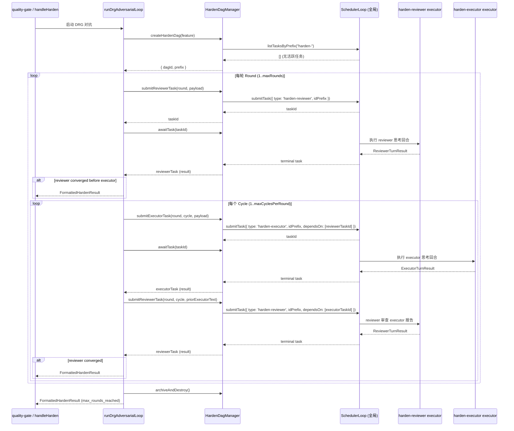

# harden-drg-async - Design

## Overview

Feature: harden-drg-async
Architecture: Architecture B（全局单例调度器 + 前缀隔离 + 轮询编排）

将 harden 命令的同步 in-process 对抗循环替换为基于 DRG 全局单例 `SchedulerLoop` 的异步任务链。每次 harden 调用在全局调度器上创建一组带前缀的任务，通过 `HardenDagManager` 管理生命周期，编排器驱动 reviewer 与 executor 之间的对话循环，直到 reviewer 判定已无 bug / 文档漂移需要继续追，或达到最大循环次数。

## Problem

**当前状态：** `src/commands/harden.ts` 中的 `runAdversarialLoop` 是同步阻塞的 in-process 循环，每轮直接调用 `ctx.client.session.prompt()` 并 await 结果。reviewer 和 executor 各自为每轮创建新 session，无法保持长生命周期对话历史。

**期望变更：**
- reviewer 和 executor 各持一个长生命周期 session，通过 DRG 任务链传递消息进行对话
- 每次 harden 调用创建独立 DAG（`harden-<uuid>-` 前缀），结束后归档/销毁
- 1 轮 = reviewer 与 executor 的完整对话（由 reviewer 判定收敛），每轮最多 5 个循环（executor 修复/审查报告一次 = 1 个循环），默认 1 轮，最多 10 轮
- harden 输出格式与现有 `formatHardenResult` 完全兼容
- quality-gate 编排逻辑不修改

## Goals

### g-0001: 置信度分级对抗
reviewer 报告包含问题、证据链和置信度（high/medium/low）。executor 必须修复 high 置信度问题；对 medium/low 自行决定是否修复；不需要修复的通过 DRG 任务输出回复 reviewer。

### g-0002: 前缀隔离的 DAG 生命周期
每次 harden 调用创建独立 DAG（`harden-<uuid>-`），任务 ID 带前缀隔离。harden 结束后整个 DAG 归档/销毁。

### g-0003: quality-gate 所有权
quality-gate 的对话负责决定是否启动 harden（风险评估）和最终收敛判定。harden 不直接修改 acceptance state 或 ImplementationRun 状态。

### g-0004: 输出格式兼容
harden 输出格式必须与现有 `HardenResult` / `formatHardenResult` 完全兼容。

### g-0005: DAG 动态生长
运行时动态创建任务；reviewer/executor 完成后由编排器根据输出决定是否注入下游任务。

## Non-Goals

- 不改造 DRG 为事件总线
- 不支持并行 harden（同一时间最多一个 harden DAG）
- 不支持分布式多进程对抗
- 不修改 DRG 引擎核心（`DagEngine`、`SchedulerLoop` 的调度语义不变）
- 不修改 reviewer/executor 的 prompt 策略（沿用 `harden.ts` 中已有的 prompt 模板）
- 不修改 quality-gate 编排逻辑

## Design Decisions

### DD-001: 使用全局单例 SchedulerLoop，不创建隔离实例
**Decision:** 复用 `src/index.ts` 中 `startOpenFlowScheduler()` 创建的全局 `SchedulerLoop` 实例，通过任务 ID 前缀实现 DAG 隔离。
**Rationale:** 保持 DRG 为全局单例，避免创建隔离的内存调度器。前缀隔离足够表达独立 DAG 语义，且不违反"DRG 核心不修改"约束。
**Note:** "异步通信总线模式"在本设计中指 reviewer/executor 通过 DRG 任务链的 payload/result 传递消息（类总线语义），DRG 本身保持为任务调度器而非事件总线。

### DD-002: 编排器采用轮询模式而非回调注入
**Decision:** `harden.ts` 中的编排函数（`runDrgAdversarialLoop`）按轮次提交 reviewer/executor 任务，通过 `HardenDagManager.awaitTask()` 轮询等待任务终态。
**Rationale:** 全局 `SchedulerLoop` 不支持 `onTaskComplete` 回调（且不应为此修改核心）。轮询模式简单、可靠、易于理解和调试。`awaitTask()` 默认 100ms 间隔、15min 超时，对 harden 场景足够高效。

### DD-003: HardenDagManager 作为薄生命周期管理器
**Decision:** `HardenDagManager` 是 ~114 行的薄包装类，职责限于：创建前缀、检查单活跃约束、提交任务（带 `dependsOn` 链）、轮询等待、归档销毁。不持有调度器状态、不持有 session、不包含业务逻辑。
**Rationale:** 将生命周期管理与业务编排解耦。Manager 不做 reviewer/executor 的策略决策，这些由编排器和 executor 函数负责。

### DD-004: Executor 函数通过工厂创建，持有 OpenFlowContext
**Decision:** `createHardenReviewerExecutor(ctx)` 和 `createHardenExecutorExecutor(ctx)` 返回 `ExecutorFunction`，通过闭包持有 `OpenFlowContext`。Executor 内部使用 `ctx.client.session` 进行 session 创建和 prompt 调用。
**Rationale:** 与 DRG `ExecutorFunction` 签名 `(task, context) => Promise<unknown>` 兼容。`OpenFlowContext` 提供必要的 session 客户端和目录信息，executor 无需直接依赖全局调度器。

### DD-005: Session 惰性创建，ID 通过任务 payload/result 链式传递
**Decision:** 首个 reviewer/executor 任务执行时，如果 payload 中没有 `sessionID`，executor 函数通过 `ctx.client.session.create()` 创建新 session 并返回 ID。编排器从任务结果中读取 session ID，注入到下一轮任务的 payload 中。
**Rationale:** 保持长生命周期 session 的核心要求。链式传递不依赖外部状态存储，session ID 随 DAG 任务链流转。

### DD-006: 3-rejection 计数器由 reviewer executor 独占维护
**Decision:** `createHardenReviewerExecutor` 闭包内维护 `rejectedCountsBySession: Map<sessionID, Map<findingKey, count>>`。每轮 reviewer 从 payload 的 `priorExecutorText` 中解析 executor 的 disposition，更新计数，过滤已达到 3 次拒绝的 finding。**编排器不维护 rejectedCounts**，仅从 reviewer 结果中读取 `rejectedCounts` 传递给下一轮任务 payload（纯透传，不做更新）。
**Rationale:** 符合 behavior.md 约束"reviewer session 自行维护计数器"。单一所有者避免双写和状态不一致。计数器通过 reviewer result → 编排器 payload 透传 → 下轮 reviewer executor 的闭包读取，形成闭环。

### DD-007: SchedulerLoop 添加通用前缀查询 API
**Decision:** 在 `SchedulerLoop` 上添加三个非 harden 特定的通用方法：`listTasksByPrefix(prefix)`、`cancelTasksByPrefix(prefix)`、`submitTask({ idPrefix })`。这些是对现有 `listTasks`/`cancelTask`/`submitTask` 的前缀快捷方式。
**Rationale:** 前缀查询是调度器的通用能力（不限于 harden）。不修改 DagEngine 核心，仅在 SchedulerLoop 层做过滤/批量操作。`idPrefix` 通过在 `createTaskId()` 生成的 UUID 前加前缀实现。

### DD-008: 现有 simple/standard 模式统一通过 DRG 驱动
**Decision:** 移除 harden.ts 中 `complexity === 'simple'` 分支和直接的 `runAdversarialLoop`。所有 harden 均通过 `runDrgAdversarialLoop` 驱动，simple 模式由 `maxRounds=1` 表达。
**Rationale:** 统一入口减少代码分支。simple 模式 = 1 轮 DRG 对抗，语义等价于当前 simple 分支。

## Architecture Overview

### Components

```
┌─────────────────────────────────────────────────────────────┐
│  harden.ts (Command Layer)                                   │
│  ┌───────────────────────┐  ┌─────────────────────────────┐ │
│  │ handleHarden()        │  │ runDrgAdversarialLoop()     │ │
│  │ - 解析参数/feature    │→ │ - 创建 HardenDagManager     │ │
│  │ - 读取 plan/design    │  │ - 按轮次编排 reviewer/      │ │
│  │ - 构建 planSummary    │  │   executor 任务提交与轮询    │ │
│  │ - 调用编排器          │  │ - 收集结果，格式化输出      │ │
│  └───────────────────────┘  └──────────┬──────────────────┘ │
└─────────────────────────────────────────┼───────────────────┘
                                          │
                    ┌─────────────────────┼───────────────────┐
                    │  HardenDagManager   │                    │
                    │  - createHardenDag  │                    │
                    │  - submitReviewer   │                    │
                    │  - submitExecutor   │                    │
                    │  - awaitTask        │                    │
                    │  - archiveAndDestroy│                    │
                    └─────────────────────┼───────────────────┘
                                          │
┌─────────────────────────────────────────┼───────────────────┐
│  SchedulerLoop (全局单例)               │                    │
│  ┌──────────────┐  ┌────────────────┐  │  ┌──────────────┐ │
│  │ DagEngine    │  │ ExecutorReg    │  │  │ StateStore   │ │
│  │ (核心不变)   │  │ - harden-      │  │  │ (持久化)     │ │
│  │              │  │   reviewer     │  │  │              │ │
│  │              │  │ - harden-      │  │  │              │ │
│  │              │  │   executor     │  │  │              │ │
│  └──────────────┘  └────────────────┘  │  └──────────────┘ │
└─────────────────────────────────────────────────────────────┘
                    │
┌───────────────────┼─────────────────────────────────────────┐
│  Harden Executors │                                         │
│  ┌────────────────┴────────────────┐                        │
│  │ createHardenReviewerExecutor()  │                        │
│  │ - 惰性创建/复用 reviewer session│                        │
│  │ - classifyFindings              │                        │
│  │ - 3-rejection 规则过滤          │                        │
│  │ - 收敛判定                      │                        │
│  └─────────────────────────────────┘                        │
│  ┌─────────────────────────────────┐                        │
│  │ createHardenExecutorExecutor()  │                        │
│  │ - 惰性创建/复用 executor session│                        │
│  │ - 解析 dispositions             │                        │
│  │ - 返回 fixReport + codeChanges  │                        │
│  └─────────────────────────────────┘                        │
└─────────────────────────────────────────────────────────────┘
```

### Component Responsibilities

| Component | File | Responsibility |
|-----------|------|---------------|
| Command Layer | `src/commands/harden.ts` | 解析参数、读取 plan/design/diff、构建 planSummary、调用编排器、格式化输出 |
| DRG Orchestrator | `src/commands/harden.ts` (`runDrgAdversarialLoop`) | 驱动 reviewer↔executor 对话循环、session ID 链式传递、结果聚合、收敛判定 |
| HardenDagManager | `src/orchestrator/harden-dag-manager.ts` | DAG 生命周期（创建前缀、单活跃守卫、任务提交、轮询等待、归档销毁） |
| SchedulerLoop | `src/orchestrator/scheduler-loop.ts` | 全局单例任务调度器（扩展 `listTasksByPrefix`、`cancelTasksByPrefix`、`idPrefix`） |
| Reviewer Executor | `src/orchestrator/harden-executors.ts` | reviewer 思考回合：session 管理、finding 分类、3-rejection 规则、收敛判定 |
| Executor Executor | `src/orchestrator/harden-executors.ts` | executor 思考回合：session 管理、disposition 解析、fixReport 生成 |
| Plugin Bootstrap | `src/index.ts` | 在全局 SchedulerLoop 上注册 `harden-reviewer` 和 `harden-executor` |

## Implementation Constraints

### IC-001: SchedulerLoop 扩展（通用，非 harden 特定）

在 `SchedulerLoop` 上添加以下方法，不修改 `DagEngine`：

```typescript
// src/orchestrator/scheduler-loop.ts
listTasksByPrefix(prefix: string): SchedulerTask[]
  // 实现: this.dagEngine.listTasks().filter(t => t.id.startsWith(prefix))

cancelTasksByPrefix(prefix: string): string[]
  // 实现: 遍历 listTasksByPrefix(prefix)，对非终态任务调用 cancelTask，返回已取消 ID 列表

// SubmitTaskInput 新增可选字段:
interface SubmitTaskInput {
  // ...existing fields...
  idPrefix?: string  // 如果提供，生成的 taskId = idPrefix + randomUUID()
}
```

**Owner:** SchedulerLoop
**Trigger:** HardenDagManager 调用
**State change:** 无（只读查询 + 批量操作）
**Failure behavior:** `cancelTasksByPrefix` 中单个 cancelTask 失败不阻断其他任务取消

### IC-002: HardenDagManager DAG 隔离与单活跃守卫

```typescript
// src/orchestrator/harden-dag-manager.ts
class HardenDagManager {
  private static activePrefix: string | undefined  // 进程级单活跃守卫

  constructor(private readonly scheduler: SchedulerLoop) {}

  createHardenDag(feature: string): { dagId: string; prefix: string }
    // 1. 检查 static activePrefix 是否有非终态任务
    // 2. 检查全局 "harden-" 前缀是否有非终态任务
    // 3. 如果有活跃任务 → throw Error('A harden DAG is already running')
    // 4. dagId = randomUUID(), prefix = "harden-${dagId}-"
    // 5. 设置 static activePrefix = prefix

  submitReviewerTask(round, payload): string
    // 调用 scheduler.submitTask({ type: 'harden-reviewer', idPrefix: prefix, dependsOn: [previousTaskId] })

  submitExecutorTask(round, payload): string
    // 同上，type: 'harden-executor'

  awaitTask(taskId: string, timeoutMs = 900000): Promise<SchedulerTask>
    // 每 100ms 轮询 scheduler.getTask(taskId)，直到终态或超时

  archiveAndDestroy(prefix?): string[]
    // cancelTasksByPrefix + 清除 activePrefix + 重置内部状态
}
```

**Owner:** HardenDagManager
**Trigger:** 编排器调用
**State change:** `activePrefix` 设置/清除、SchedulerLoop 中任务创建/取消
**Failure behavior:** `createHardenDag` 违反单活跃约束时抛出异常；`awaitTask` 超时时抛出 Error

### IC-003: Reviewer Executor 输出 Schema

```typescript
// harden-reviewer executor 返回:
interface ReviewerTurnResult {
  sessionID: string        // reviewer session ID（新建或复用）
  text: string             // reviewer 原始输出文本
  tokens: number           // 本轮消耗 token
  findings: HardenFinding[]  // 过滤后的 finding（已应用 3-rejection 规则）
  converged: boolean       // 是否收敛
  reason: string           // 'no_findings' | 'max_rounds_reached' | 'max_cycles_reached' | 'actionable_findings' | 'non_blocking_only' | 'review_inconclusive'
  rejectedCounts: Record<string, number>  // 当前累计拒绝计数
}
```

**Owner:** `createHardenReviewerExecutor`
**Trigger:** SchedulerLoop 调度执行
**State change:** 闭包内 `rejectedCountsBySession` 更新（**唯一所有者**，编排器不做二次更新）
**Failure behavior:** session 创建失败或 prompt 失败 → 任务标记为 failed

### IC-004: Executor Executor 输出 Schema

```typescript
// harden-executor executor 返回:
interface ExecutorTurnResult {
  sessionID: string        // executor session ID（新建或复用）
  text: string             // executor 原始输出文本
  tokens: number           // 本轮消耗 token
  dispositions: ParsedDisposition[]  // 解析后的 finding verdict
  fixReport: string        // executor 修复报告
  codeChanges: string      // 代码变更描述
}
```

**Owner:** `createHardenExecutorExecutor`
**Trigger:** SchedulerLoop 调度执行
**State change:** 无（executor 是无状态的，结果通过 task.result 传递）
**Failure behavior:** session 创建失败或 prompt 失败 → 任务标记为 failed

### IC-005: 编排器对话循环

**核心概念：**

| 概念 | 含义 | 默认值 | 上限 |
|------|------|--------|------|
| **循环（Cycle）** | reviewer 出报告 → executor 修复/审查 → executor 出报告，算 1 个循环 | — | 5 |
| **轮（Round）** | reviewer 与 executor 的完整对话，由 reviewer 判定收敛（或循环耗尽），算 1 轮 | 1 | 10 |

**对话流程：**

```
Round（1 轮）:
  ┌─── Reviewer 开启会话，查找 bug 与文档漂移
  │
  ├─ Cycle 1: Reviewer 出报告(含置信度、证据链) → 以消息传给 Executor
  │            Executor 修复 high 置信度 bug，审查 medium/low
  │            Executor 出报告 → 以消息传给 Reviewer
  │
  ├─ Cycle 2: Reviewer 审查 Executor 报告
  │            如有争议 → Reviewer 出新报告 → Executor 修复/审查 → 报告
  │            reviewer 判定无 bug / 文档漂移需要继续追 → 收敛，本轮结束
  │            ...
  ├─ Cycle N (max 5)
  │
  └─→ 收敛 or 循环耗尽 → 本轮结束
```

**编排器伪代码：**

```typescript
// src/commands/harden.ts - runDrgAdversarialLoop
async function runDrgAdversarialLoop(
  ctx, planSummary, diffScopeContext, args, coordinatorSessionID, sanitizedFeature
): Promise<FormattedHardenResult> {
  const scheduler = getSchedulerLoop()  // 全局单例
  const manager = new HardenDagManager(scheduler)
  const { dagId, prefix } = manager.createHardenDag(sanitizedFeature)
  const maxCyclesPerRound = args.maxCyclesPerRound ?? 5

  let reviewerSessionID: string | undefined
  let executorSessionID: string | undefined
  const allRounds: HardenRoundResult[] = []
  const trace: FormattedHardenTraceEntry[] = []
  let totalTokens = 0

  try {
    for (let round = 1; round <= args.maxRounds; round++) {
      const cycleResults: CycleResult[] = []
      let converged = false

      // ─── Cycle 0: Reviewer 初始审查 ───
      const initialReviewerTaskId = manager.submitReviewerTask(round, {
        agent: 'harden-reviewer',
        sessionID: reviewerSessionID,
        systemPrompt: REVIEWER_SYSTEM_PROMPT,
        userPrompt: buildReviewerPrompt(planSummary, diffStr),
        round, maxRounds: args.maxRounds,
        parentSessionID: coordinatorSessionID,
        feature: sanitizedFeature,
      })

      let reviewerTask = await manager.awaitTask(initialReviewerTaskId)
      let reviewerResult = reviewerTask.result as ReviewerTurnResult
      reviewerSessionID = reviewerResult.sessionID
      totalTokens += reviewerResult.tokens
      trace.push(buildTraceEntry(round, 0, 'oracle', reviewerResult))

      // 初始审查即无 findings → 直接收敛
      if (reviewerResult.converged) {
        allRounds.push({ round, findings: reviewerResult.findings })
        return buildConvergedResult(round, reviewerResult, allRounds, trace, totalTokens, coordinatorSessionID)
      }

      // ─── Cycles 1..N: Reviewer ↔ Executor 对话循环 ───
      for (let cycle = 1; cycle <= maxCyclesPerRound; cycle++) {
        // 过滤 executor 可修复的 findings
        const executorFindings = filterForExecutor(reviewerResult.findings)

        // Executor 修复/审查
        const executorTaskId = manager.submitExecutorTask(round, {
          agent: 'harden-executor',
          sessionID: executorSessionID,
          systemPrompt: EXECUTOR_SYSTEM_PROMPT,
          userPrompt: buildExecutorPrompt(executorFindings, planSummary, ...),
          round, cycle, maxRounds: args.maxRounds,
          parentSessionID: coordinatorSessionID,
          feature: sanitizedFeature,
        })

        const executorTask = await manager.awaitTask(executorTaskId)
        const executorResult = executorTask.result as ExecutorTurnResult
        executorSessionID = executorResult.sessionID
        totalTokens += executorResult.tokens
        trace.push(buildTraceEntry(round, cycle, 'deep', executorResult))

        cycleResults.push({ cycle, findings: reviewerResult.findings, fixReport: executorResult.fixReport })

        // Reviewer 审查 Executor 报告。注意：每个 executor 报告后都必须回到 reviewer；
        // executor 无权结束循环，只有 reviewer 可以判定收敛。
        const verifyTaskId = manager.submitReviewerTask(round, {
          agent: 'harden-reviewer',
          sessionID: reviewerSessionID,
          systemPrompt: REVIEWER_SYSTEM_PROMPT,
          userPrompt: buildReviewerPrompt(planSummary, diffStr, reviewerResult.findings, executorResult.fixReport),
          round, cycle, maxRounds: args.maxRounds,
          parentSessionID: coordinatorSessionID,
          feature: sanitizedFeature,
          priorExecutorText: executorResult.text,
        })

        reviewerTask = await manager.awaitTask(verifyTaskId)
        reviewerResult = reviewerTask.result as ReviewerTurnResult
        reviewerSessionID = reviewerResult.sessionID
        totalTokens += reviewerResult.tokens
        trace.push(buildTraceEntry(round, cycle, 'oracle', reviewerResult))

        // Reviewer 认为无需继续 → 收敛
        if (reviewerResult.converged) {
          converged = true
          break
        }

        // Reviewer 认为仍有问题，但本轮循环次数耗尽 → 本轮无法继续，交由外层 maxRounds 决策
        if (cycle >= maxCyclesPerRound) break

        // Reviewer 认为仍有问题 → 下一循环（executor 继续修复）
      }

      // 汇总本轮
      allRounds.push({
        round,
        findings: cycleResults.flatMap(c => c.findings),
        fixReport: cycleResults.map(c => c.fixReport).filter(Boolean).join('\n\n'),
      })

      if (converged) {
        return buildConvergedResult(round, reviewerResult, allRounds, trace, totalTokens, coordinatorSessionID)
      }
    }

    // 达到 max rounds
    return buildMaxRoundsResult(allRounds, trace, totalTokens, coordinatorSessionID)
  } finally {
    manager.archiveAndDestroy()
  }
}
```

**Owner:** `harden.ts` 编排层
**Trigger:** `handleHarden` 调用
**State change:** SchedulerLoop 中任务创建/完成；局部变量 `reviewerSessionID`、`executorSessionID` 随对话更新
**Failure behavior:** 任何任务 failed → 编排器在 finally 中调用 `archiveAndDestroy()`，返回包含错误信息的 `FormattedHardenResult`
**Round/Cycle semantics:**
- 1 轮（Round）= reviewer 与 executor 的完整对话，由 reviewer 判定收敛（或 5 循环耗尽）
- 1 循环（Cycle）= reviewer 出报告 → executor 修复/审查 → executor 出报告
- 默认 1 轮 × 5 循环 = 最多 5 次 executor 修复
- 终止判定权在 reviewer：executor 无权结束循环；每个 executor 报告后必须由 reviewer 审查，reviewer 认为无 bug / 文档漂移需要继续追时才收敛

### IC-006: Plugin Bootstrap 注册

```typescript
// src/index.ts - OpenFlowPlugin 函数内，在 current-promotion 注册之后
import { createHardenReviewerExecutor, createHardenExecutorExecutor } from './orchestrator/harden-executors.js'

// 在 schedulerLoop 创建后:
if (!schedulerLoop.hasExecutor('harden-reviewer')) {
  schedulerLoop.registerExecutor('harden-reviewer', createHardenReviewerExecutor(openflowCtx))
}
if (!schedulerLoop.hasExecutor('harden-executor')) {
  schedulerLoop.registerExecutor('harden-executor', createHardenExecutorExecutor(openflowCtx))
}
```

**Owner:** `src/index.ts`
**Trigger:** 插件初始化
**State change:** ExecutorRegistry 中新增两个 executor
**Failure behavior:** import 失败 → 不影响其他功能，harden 命令将返回错误

### IC-007: 输出格式兼容

编排器返回的 `FormattedHardenResult` 必须包含现有 `formatHardenResult` 所需的所有字段：

```typescript
interface FormattedHardenResult {
  status: 'pass' | 'pass_with_risks' | 'needs_human' | 'executor_blocked' | 'max_rounds_reached' | 'rejected'
  rounds: Array<{ round: number; findings: HardenFinding[]; fixReport?: string }>
  budgetConsumed: number
  totalTokensConsumed: number
  summary: string
  stopReason?: string
  sessionID?: string            // coordinator session ID
  coordinatorSessionId?: string // 同上
  trace?: FormattedHardenTraceEntry[]
}
```

**Owner:** 编排器
**Verification:** 对比现有 `HardenResult` 类型定义，确保所有字段存在且语义一致

### IC-008: 轮次 / 循环配置守卫

```typescript
function normalizeMaxRounds(requested: number | undefined): { rounds: number; warning?: string } {
  const DEFAULT = 1
  const MAX_CEILING = 10
  if (requested === undefined) return { rounds: DEFAULT }
  if (requested < 1) return { rounds: DEFAULT, warning: `maxRounds=${requested} < 1, reset to ${DEFAULT}` }
  if (requested > MAX_CEILING) return { rounds: MAX_CEILING, warning: `maxRounds=${requested} > ${MAX_CEILING}, clamped to ${MAX_CEILING}` }
  return { rounds: requested }
}

function normalizeMaxCyclesPerRound(requested: number | undefined): { cycles: number; warning?: string } {
  const DEFAULT = 5
  const MAX_CEILING = 5
  if (requested === undefined) return { cycles: DEFAULT }
  if (requested < 1) return { cycles: DEFAULT, warning: `maxCyclesPerRound=${requested} < 1, reset to ${DEFAULT}` }
  if (requested > MAX_CEILING) return { cycles: MAX_CEILING, warning: `maxCyclesPerRound=${requested} > ${MAX_CEILING}, clamped to ${MAX_CEILING}` }
  return { cycles: requested }
}
```

**Owner:** 编排器
**State change:** 无（纯函数）
**Failure behavior:** 越界值被 clamp，附带 warning。默认 `maxRounds=1`、`maxCyclesPerRound=5`。

## Task Flows

### 标准 harden DRG 对抗流程



## Data Contracts

### Reviewer Task Payload

| Field | Type | Required | Description |
|-------|------|----------|-------------|
| agent | `'harden-reviewer'` | Yes | Executor 路由标识 |
| sessionID | `string` | No | 复用的 reviewer session ID |
| systemPrompt | `string` | Yes | Reviewer system prompt |
| userPrompt | `string` | Yes | Reviewer user prompt (含 diff、plan、prior findings) |
| round | `number` | Yes | 当前轮次 |
| cycle | `number` | No | 当前循环编号；初始 reviewer 审查可省略或为 0 |
| maxRounds | `number` | Yes | 最大轮次 |
| maxCyclesPerRound | `number` | No | 每轮最大循环次数，默认 5 |
| parentSessionID | `string` | No | Coordinator session ID (用于创建子 session) |
| feature | `string` | No | Feature 名称 |
| model | `string` | No | 指定 reviewer model |
| rejectedCounts | `Record<string, number>` | No | 当前 finding 拒绝计数 |
| priorExecutorText | `string` | No | 上一轮 executor 输出 (用于解析 disposition) |

### Executor Task Payload

| Field | Type | Required | Description |
|-------|------|----------|-------------|
| agent | `'harden-executor'` | Yes | Executor 路由标识 |
| sessionID | `string` | No | 复用的 executor session ID |
| systemPrompt | `string` | Yes | Executor system prompt |
| userPrompt | `string` | Yes | Executor user prompt (含 findings、plan、file paths) |
| round | `number` | Yes | 当前轮次 |
| cycle | `number` | Yes | 当前循环编号；executor 每输出一次修复/审查报告算 1 个循环 |
| maxRounds | `number` | Yes | 最大轮次 |
| maxCyclesPerRound | `number` | No | 每轮最大循环次数，默认 5 |
| parentSessionID | `string` | No | Coordinator session ID |
| feature | `string` | No | Feature 名称 |
| model | `string` | No | 指定 executor model |
| codeChanges | `string` | No | 已有代码变更描述 |

## Integration Boundaries

### harden.ts → HardenDagManager
**Contract:** 编排器通过 Manager 提交任务、轮询结果、管理 DAG 生命周期
**Allowed:** 创建/销毁 DAG、提交任务、等待任务、取消 DAG
**Forbidden:** 直接操作 SchedulerLoop（通过 Manager 间接使用）

### HardenDagManager → SchedulerLoop
**Contract:** Manager 调用通用前缀 API 管理任务
**Allowed:** `listTasksByPrefix`、`cancelTasksByPrefix`、`submitTask` (with `idPrefix`)
**Forbidden:** 修改 SchedulerLoop 内部状态、依赖 harden 特有的调度行为

### Harden Executors → OpenFlowContext
**Contract:** Executor 通过 `ctx.client.session` 进行 AI 对话
**Allowed:** `session.create()`、`session.prompt()`
**Forbidden:** 直接调用 SchedulerLoop、修改全局状态

### quality-gate → harden
**Contract:** quality-gate 调用 `handleHarden` 获取 harden 结果，不做额外的 harden 启动/停止控制
**Allowed:** 读取 `FormattedHardenResult` 中的 status、findings、summary
**Forbidden:** 直接操作 DAG、绕过 harden 命令层

## State Transitions

### DAG 生命周期状态

```
[不存在] ──createHardenDag()──→ [active]
   ↑                                │
   │         archiveAndDestroy()    │
   └────────────────────────────────┘
                                    │
                              [destroyed]
```

### 单轮 Round 内的 Cycle 任务链

```
reviewer-initial-task: pending → ready → running → succeeded
                                                   │
                                           dependsOn chain
                                                   │
executor-cycle-1-task: pending → ready → running → succeeded
                                                   │
                                           dependsOn chain
                                                   │
reviewer-verify-cycle-1-task: pending → ready → running → succeeded
                                                   │
                              ┌────────────────────┴────────────────────┐
                              │                                         │
                       reviewer converged                         reviewer continues
                              │                                         │
                           round ends                         executor-cycle-2-task → ...
```

### Reviewer 收敛判定

```
reviewer 完成 → converged?
  ├── reason = 'no_findings'          → 终止，status = 'pass'
  ├── reason = 'non_blocking_only'    → 终止，status = 'pass_with_risks'
  ├── reason = 'max_rounds_reached'   → 终止，status = 'max_rounds_reached'
  ├── reason = 'max_cycles_reached'   → 本轮结束；如 maxRounds 未耗尽则进入下一轮，否则终止
  └── reason = 'actionable_findings'  → 继续，提交 executor
```

## Risks And Mitigations

| Risk | Impact | Mitigation |
|------|--------|-----------|
| 全局 SchedulerLoop 上 harden 任务与其他任务竞争 | 低（harden 串行执行，maxConcurrency=2 足够） | Monitor 任务队列深度 |
| `awaitTask` 轮询开销 | 极低（100ms 间隔，AI 回合通常秒级） | 可接受；如需优化可改用 event emitter |
| 3-rejection 闭包状态在进程重启后丢失 | 中（进程内运行期间可靠，重启后计数归零） | 后续迭代可将 rejectedCounts 持久化到任务 payload |
| `activePrefix` 静态字段不跨进程 | 低（当前为单进程模型） | 如需多进程可在 SchedulerLoop 层加分布式锁 |
| Executor prompt 不兼容新的 disposition 格式 | 低（沿用现有 prompt 模板和解析逻辑） | 保持 prompt 格式稳定，解析器兼容多种格式 |

## Testing Strategy

### Unit Tests
- `tests/orchestrator/harden-dag-manager.test.ts`: Manager 生命周期（创建、单活跃守卫、任务提交、归档销毁）
- `tests/orchestrator/harden-executors.test.ts`: Executor 函数（session 惰性创建、finding 分类、3-rejection 规则、convergence 判定、disposition 解析）
- `tests/orchestrator/scheduler-loop.test.ts`: 新增前缀 API 测试

### Integration Tests
- `tests/harden/orchestration.test.ts`: 编排器端到端（mock SchedulerLoop + executor，验证轮次循环、收敛终止、max rounds）
- `tests/commands/harden-drg-async.test.ts`: 命令层集成（验证 FormattedHardenResult 格式兼容）

### Regression Tests
- 验证 harden 输出格式与 `formatHardenResult` 完全兼容
- 验证 quality-gate 能正确消费 harden 结果
- 验证现有 test suite 无回归

## Files Changed

| File | Change Type | Description |
|------|-------------|-------------|
| `src/orchestrator/scheduler-loop.ts` | 修改 | 添加 `listTasksByPrefix`、`cancelTasksByPrefix`、`idPrefix` 支持 |
| `src/orchestrator/harden-dag-manager.ts` | 重写 | 从 517 行自建调度器简化为 ~114 行薄包装 |
| `src/orchestrator/harden-executors.ts` | 重写 | 从 383 行自包含 prompt 简化为 ~249 行 payload 驱动 |
| `src/commands/harden.ts` | 修改 | 新增 `runDrgAdversarialLoop`，移除直接 `runAdversarialLoop` 调用 |
| `src/index.ts` | 修改 | 注册 harden-reviewer 和 harden-executor |
| `src/orchestrator/harden-types.ts` | 删除 | 类型内联到各模块 |
| `src/orchestrator/scheduler-state-store.ts` | 删除 | 不再需要 InMemorySchedulerStateStore |
