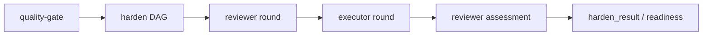

# harden-drg-async - Design

## Overview

Feature: harden-drg-async
Completeness: complete
<<<<<<< Updated upstream
=======

Primary goals:
- reviewer 报告包含：问题、证据链、置信度（高/中/低）。executor 修复高置信度问题；对中低置信度自行决定是否修复；不需要修复的通过 DRG 报告回复 reviewer。
- 每次 harden 调用创建独立 DAG（如 harden-<uuid\>），任务 ID 带前缀隔离。harden 结束后整个 DAG 归档/销毁。
- quality-gate 的对话负责决定是否启动 harden（风险评估）和最终收敛判定。harden 不直接修改 acceptance state 或 ImplementationRun 状态。
- harden 输出格式必须与现有格式兼容
- DAG 动态生长: 运行时动态创建，reviewer/executor 完成后根据输出决定是否注入下游任务
>>>>>>> Stashed changes

Primary goals:
- reviewer 报告包含：问题、证据链、置信度（高/中/低）。executor 修复高置信度问题；对中低置信度自行决定是否修复；不需要修复的通过 DRG 报告回复 reviewer。
- 每次 harden 调用创建独立 DAG（如 harden-<uuid\>），任务 ID 带前缀隔离。harden 结束后整个 DAG 归档/销毁。
- quality-gate 的对话负责决定是否启动 harden（风险评估）和最终收敛判定。harden 不直接修改 acceptance state 或 ImplementationRun 状态。
- harden 输出格式必须与现有格式兼容
- DAG 动态生长: 运行时动态创建，reviewer/executor 完成后根据输出决定是否注入下游任务
## Problem

**Current state:** 重新设计 harden 工作流，使用 DRG 做异步 AI 对话交互
<<<<<<< Updated upstream
=======

**Desired change:** reviewer 报告包含：问题、证据链、置信度（高/中/低）。executor 修复高置信度问题；对中低置信度自行决定是否修复；不需要修复的通过 DRG 报告回复 reviewer。; 每次 harden 调用创建独立 DAG（如 harden-<uuid\>），任务 ID 带前缀隔离。harden 结束后整个 DAG 归档/销毁。; quality-gate 的对话负责决定是否启动 harden（风险评估）和最终收敛判定。harden 不直接修改 acceptance state 或 ImplementationRun 状态。
>>>>>>> Stashed changes

**Desired change:** reviewer 报告包含：问题、证据链、置信度（高/中/低）。executor 修复高置信度问题；对中低置信度自行决定是否修复；不需要修复的通过 DRG 报告回复 reviewer。; 每次 harden 调用创建独立 DAG（如 harden-<uuid\>），任务 ID 带前缀隔离。harden 结束后整个 DAG 归档/销毁。; quality-gate 的对话负责决定是否启动 harden（风险评估）和最终收敛判定。harden 不直接修改 acceptance state 或 ImplementationRun 状态。
## Goals

### g-0001: reviewer 报告包含：问题、证据链、置信度（高/中/低）。executor 修复高置信度问题；对中低置信度自行决定是否修复；不需要修复的通过 DRG 报告回复 reviewer。
> Derived from confirmed constraint evidence

### g-0002: 每次 harden 调用创建独立 DAG（如 harden-<uuid\>），任务 ID 带前缀隔离。harden 结束后整个 DAG 归档/销毁。
> Derived from confirmed constraint evidence

### g-0003: quality-gate 的对话负责决定是否启动 harden（风险评估）和最终收敛判定。harden 不直接修改 acceptance state 或 ImplementationRun 状态。
> Derived from confirmed constraint evidence

### g-0004: harden 输出格式必须与现有格式兼容
> Derived from confirmed constraint evidence

### g-0005: DAG 动态生长: 运行时动态创建，reviewer/executor 完成后根据输出决定是否注入下游任务
> Derived from confirmed decision evidence

## Non-Goals

- 不改造 DRG 为事件总线
- 不支持并行 harden
- 不支持分布式多进程对抗
- 不修改 reviewer/executor 的 prompt 策略
<<<<<<< Updated upstream
## Design Decisions

### 惰性创建，链式传递 session ID。reviewer\_round\_1 现场
- **Decision:** 惰性创建，链式传递 session ID。reviewer\_round\_1 现场创建 reviewer session，executor\_round\_1 现场创建 executor session。后续任务从上游任务输出中读取 ID 复用。
- **Rationale:** From feature-fact \(high confidence\)

### 当前 harden 的同步 in-process reviewer→execut
- **Decision:** 当前 harden 的同步 in-process reviewer→executor 循环（src/commands/harden.ts 中的 runAdversarialLoop）将被替换为 DRG 异步任务链。rebuttal 子循环被移除，由 reviewer↔executor 的多轮对抗替代。
- **Rationale:** From feature-fact \(high confidence\)

### 现有 DRG 引擎（src/orchestrator/drg-engine.ts
- **Decision:** 现有 DRG 引擎（src/orchestrator/drg-engine.ts）需要扩展：支持运行时动态添加任务节点（用于表达 reviewer→executor→reviewer 的循环链）；支持任务间数据传递（session ID 链式传递）。
- **Rationale:** From feature-fact \(high confidence\)

### DRG 角色
- **Decision:** DRG 角色: 全局单例任务调度器，插件启动时初始化，不改造成事件总线 \(理由: 事件总线无法表达串行依赖约束，DRG 的 DAG 模型天然适合 reviewer→executor 串行执行\)
- **Rationale:** From brainstorm-packet-v1 \(high confidence\)

### harden 隔离
- **Decision:** harden 隔离: 每次 harden 调用创建独立 DAG（harden-<uuid\>），结束后归档销毁 \(理由: 独立 DAG 便于调试和归档，不同 harden 实例互不干扰\)
- **Rationale:** From brainstorm-packet-v1 \(high confidence\)

### 对抗模型
- **Decision:** 对抗模型: 异步通信总线，reviewer 和 executor 各持长 session，DRG 调度思考回合任务在已有 session 上追加消息 \(理由: 长 session 保留完整对抗历史，提升推理一致性；像聊天一样追加消息更自然\)
- **Rationale:** From brainstorm-packet-v1 \(high confidence\)

### 任务粒度
- **Decision:** 任务粒度: 思考回合任务，让 reviewer/executor session 基于当前消息历史生成下一轮报告 \(理由: 与现有 DRG 任务执行模型匹配\)
- **Rationale:** From brainstorm-packet-v1 \(high confidence\)

### Session 创建
- **Decision:** Session 创建: 惰性创建，首个需要某类型 session 的 DRG 任务现场创建，session ID 链式传递 \(理由: 避免预创建未使用的 session，链式传递是最简单的不依赖外部状态的方案\)
- **Rationale:** From brainstorm-packet-v1 \(high confidence\)

### 默认轮次
- **Decision:** 默认轮次: 1 轮对抗（reviewer→executor→reviewer），可配置最多 10 轮，串行执行 \(理由: 多数 harden 只需一轮收敛，减少不必要的 token 消耗\)
- **Rationale:** From brainstorm-packet-v1 \(high confidence\)

### 终止条件
- **Decision:** 终止条件: reviewer 判定无争议（executor 上报为空或全部认可），或达到 max rounds \(理由: executor 不能单方面静默结束，避免跳过真正的问题\)
- **Rationale:** From brainstorm-packet-v1 \(high confidence\)

### 驳回规则
- **Decision:** 驳回规则: 同一 finding 被 executor 连续拒绝 3 次，reviewer session 自维护计数器，达到后不再上报 \(理由: 防止无限循环，reviewer 自维护最简洁，不增加架构复杂度\)
- **Rationale:** From brainstorm-packet-v1 \(high confidence\)

=======

## Design Decisions

### 惰性创建，链式传递 session ID。reviewer\_round\_1 现场
- **Decision:** 惰性创建，链式传递 session ID。reviewer\_round\_1 现场创建 reviewer session，executor\_round\_1 现场创建 executor session。后续任务从上游任务输出中读取 ID 复用。
- **Rationale:** From feature-fact \(high confidence\)

### 当前 harden 的同步 in-process reviewer→execut
- **Decision:** 当前 harden 的同步 in-process reviewer→executor 循环（src/commands/harden.ts 中的 runAdversarialLoop）将被替换为 DRG 异步任务链。rebuttal 子循环被移除，由 reviewer↔executor 的多轮对抗替代。
- **Rationale:** From feature-fact \(high confidence\)

### 现有 DRG 引擎（src/orchestrator/drg-engine.ts
- **Decision:** 现有 DRG 引擎（src/orchestrator/drg-engine.ts）需要扩展：支持运行时动态添加任务节点（用于表达 reviewer→executor→reviewer 的循环链）；支持任务间数据传递（session ID 链式传递）。
- **Rationale:** From feature-fact \(high confidence\)

### DRG 角色
- **Decision:** DRG 角色: 全局单例任务调度器，插件启动时初始化，不改造成事件总线 \(理由: 事件总线无法表达串行依赖约束，DRG 的 DAG 模型天然适合 reviewer→executor 串行执行\)
- **Rationale:** From brainstorm-packet-v1 \(high confidence\)

### harden 隔离
- **Decision:** harden 隔离: 每次 harden 调用创建独立 DAG（harden-<uuid\>），结束后归档销毁 \(理由: 独立 DAG 便于调试和归档，不同 harden 实例互不干扰\)
- **Rationale:** From brainstorm-packet-v1 \(high confidence\)

### 对抗模型
- **Decision:** 对抗模型: 异步通信总线，reviewer 和 executor 各持长 session，DRG 调度思考回合任务在已有 session 上追加消息 \(理由: 长 session 保留完整对抗历史，提升推理一致性；像聊天一样追加消息更自然\)
- **Rationale:** From brainstorm-packet-v1 \(high confidence\)

### 任务粒度
- **Decision:** 任务粒度: 思考回合任务，让 reviewer/executor session 基于当前消息历史生成下一轮报告 \(理由: 与现有 DRG 任务执行模型匹配\)
- **Rationale:** From brainstorm-packet-v1 \(high confidence\)

### Session 创建
- **Decision:** Session 创建: 惰性创建，首个需要某类型 session 的 DRG 任务现场创建，session ID 链式传递 \(理由: 避免预创建未使用的 session，链式传递是最简单的不依赖外部状态的方案\)
- **Rationale:** From brainstorm-packet-v1 \(high confidence\)

### 默认轮次
- **Decision:** 默认轮次: 1 轮对抗（reviewer→executor→reviewer），可配置最多 10 轮，串行执行 \(理由: 多数 harden 只需一轮收敛，减少不必要的 token 消耗\)
- **Rationale:** From brainstorm-packet-v1 \(high confidence\)

### 终止条件
- **Decision:** 终止条件: reviewer 判定无争议（executor 上报为空或全部认可），或达到 max rounds \(理由: executor 不能单方面静默结束，避免跳过真正的问题\)
- **Rationale:** From brainstorm-packet-v1 \(high confidence\)

### 驳回规则
- **Decision:** 驳回规则: 同一 finding 被 executor 连续拒绝 3 次，reviewer session 自维护计数器，达到后不再上报 \(理由: 防止无限循环，reviewer 自维护最简洁，不增加架构复杂度\)
- **Rationale:** From brainstorm-packet-v1 \(high confidence\)

>>>>>>> Stashed changes
### DAG 动态生长
- **Decision:** DAG 动态生长: 运行时动态创建，reviewer/executor 完成后根据输出决定是否注入下游任务 \(理由: 不需要编排器，reviewer 和 executor 自行决定是否继续对抗\)
- **Rationale:** From brainstorm-packet-v1 \(high confidence\)

## Design Constraints

- [must] [time] DRG 保持为全局单例任务调度器（不是事件总线），插件启动时初始化。所有异步任务共享同一个 SchedulerLoop 和 DagEngine 实例，统一状态存储。
  - Rationale: From feature-fact
- [must] [scope] 每次 harden 调用创建独立 DAG（如 harden-<uuid\>），任务 ID 带前缀隔离。harden 结束后整个 DAG 归档/销毁。
  - Rationale: From feature-fact
- [must] [scope] 异步通信总线模式：reviewer 和 executor 各持一个长生命周期 session，DRG 调度'思考回合任务'在已有 session 上追加消息。像聊天一样来回对话。
  - Rationale: From feature-fact
- [must] [scope] DRG 任务粒度是'思考回合'：让 session 基于当前消息历史生成下一轮报告。任务输出包含 session ID 和报告内容。
  - Rationale: From feature-fact
- [must] [scope] 默认1轮对抗（reviewer→executor→reviewer 为一轮），可配置最多10轮，串行执行。当前默认是 maxRounds=5，改为1。
  - Rationale: From feature-fact
- [must] [scope] 流程结束当且仅当 reviewer 在一轮审查后认为没有需要继续追的问题（executor 的上报为空或 reviewer 全部认可），或达到 max rounds。终止判定权在 reviewer。
  - Rationale: From feature-fact
- [must] [scope] 同一 finding 被 executor 连续拒绝3次后，reviewer session 自行维护计数器，达到3次后忽略该 finding，不再上报给 executor。
  - Rationale: From feature-fact
- [must] [scope] reviewer 报告包含：问题、证据链、置信度（高/中/低）。executor 修复高置信度问题；对中低置信度自行决定是否修复；不需要修复的通过 DRG 报告回复 reviewer。
  - Rationale: From feature-fact
- [must] [scope] quality-gate 的对话负责决定是否启动 harden（风险评估）和最终收敛判定。harden 不直接修改 acceptance state 或 ImplementationRun 状态。
  - Rationale: From feature-fact
- [must] [scope] DRG 引擎核心不因本功能修改
- [must] [scope] harden 输出格式必须与现有格式兼容
- [must] [scope] quality-gate 编排逻辑不修改
- [must] [scope] 同一时间最多一个 harden DAG 运行
<<<<<<< Updated upstream
## Execution Safety / Confirmation Guard

Automatic execution is constrained by the following confirmation / safety guard mechanisms:
- quality-gate 的对话负责决定是否启动 harden（风险评估）和最终收敛判定。harden 不直接修改 acceptance state 或 ImplementationRun 状态。
## State Isolation / Safety

Global/cross-session state is constrained by the following isolation mechanisms:
- 每次 harden 调用创建独立 DAG（如 harden-<uuid\>），任务 ID 带前缀隔离。harden 结束后整个 DAG 归档/销毁。
## Architecture Overview

### Components
- **quality-gate**: Entry point and readiness owner for harden execution
  - Decide whether harden should start before creating a DAG
  - Consume the final harden\_result/readiness output
  - Expose final findings and Code Changes for user review
- **DRG harden DAG**: Isolated task graph for one complex harden run
  - Keep each harden run isolated with a per-run DAG identity
  - Chain reviewer/executor task outputs to downstream tasks
  - Support abort/timeout/failure propagation without mixing runs
- **reviewer session**: Adversarial reviewer that owns findings and convergence decisions
  - Report findings into the harden message flow
  - Review executor replies and decide whether another round is needed
  - Produce the final harden result when convergence or limits are reached
- **executor session**: Repair agent that responds to reviewer findings
  - Fix high-confidence findings when applicable
  - Report rejected or deferred findings back through DRG task output
  - Keep code changes visible for final quality-gate review
## Task Flows

### quality-gate harden DRG flow

1. **quality-gate**: Evaluate harden need and create an isolated harden DAG when required
   → Output: harden DAG identity and initial reviewer task
2. **reviewer session**: Report adversarial findings from the current message history
   → Output: findings for executor task input
3. **executor session**: Fix high-confidence findings and report unresolved findings
   → Output: code changes and executor reply
4. **reviewer session**: Assess executor reply and decide whether to continue or finish
   → Output: final harden\_result or next round request
5. **quality-gate**: Consume the final harden\_result for readiness assessment
   → Output: quality-gate readiness and user-visible final report

## Data Contracts

### harden\_result
Purpose: Final output consumed by quality-gate and shown to the user during assessment

| Field | Type | Required | Description |
|-------|------|----------|-------------|
| findings | Finding\[\] | Yes | Reviewer findings and final disposition |
| codeChanges | CodeChange\[\] | No | Visible code changes for quality-gate review |
| readiness | ReadinessStatus | Yes | Final readiness signal consumed by quality-gate |

=======

## Execution Safety / Confirmation Guard

Automatic execution is constrained by the following confirmation / safety guard mechanisms:
- quality-gate 的对话负责决定是否启动 harden（风险评估）和最终收敛判定。harden 不直接修改 acceptance state 或 ImplementationRun 状态。

## State Isolation / Safety

Global/cross-session state is constrained by the following isolation mechanisms:
- 每次 harden 调用创建独立 DAG（如 harden-<uuid\>），任务 ID 带前缀隔离。harden 结束后整个 DAG 归档/销毁。

## Architecture Overview

### Components
- **quality-gate**: Entry point and readiness owner for harden execution
  - Decide whether harden should start before creating a DAG
  - Consume the final harden\_result/readiness output
  - Expose final findings and Code Changes for user review
- **DRG harden DAG**: Isolated task graph for one complex harden run
  - Keep each harden run isolated with a per-run DAG identity
  - Chain reviewer/executor task outputs to downstream tasks
  - Support abort/timeout/failure propagation without mixing runs
- **reviewer session**: Adversarial reviewer that owns findings and convergence decisions
  - Report findings into the harden message flow
  - Review executor replies and decide whether another round is needed
  - Produce the final harden result when convergence or limits are reached
- **executor session**: Repair agent that responds to reviewer findings
  - Fix high-confidence findings when applicable
  - Report rejected or deferred findings back through DRG task output
  - Keep code changes visible for final quality-gate review

## Task Flows

### quality-gate harden DRG flow

1. **quality-gate**: Evaluate harden need and create an isolated harden DAG when required
   → Output: harden DAG identity and initial reviewer task
2. **reviewer session**: Report adversarial findings from the current message history
   → Output: findings for executor task input
3. **executor session**: Fix high-confidence findings and report unresolved findings
   → Output: code changes and executor reply
4. **reviewer session**: Assess executor reply and decide whether to continue or finish
   → Output: final harden\_result or next round request
5. **quality-gate**: Consume the final harden\_result for readiness assessment
   → Output: quality-gate readiness and user-visible final report

## Data Contracts

### harden\_result
Purpose: Final output consumed by quality-gate and shown to the user during assessment

| Field | Type | Required | Description |
|-------|------|----------|-------------|
| findings | Finding\[\] | Yes | Reviewer findings and final disposition |
| codeChanges | CodeChange\[\] | No | Visible code changes for quality-gate review |
| readiness | ReadinessStatus | Yes | Final readiness signal consumed by quality-gate |

>>>>>>> Stashed changes
## Integration Boundaries

### quality-gate → harden DRG flow
Contract: quality-gate owns start/stop/readiness decisions and consumes final harden\_result output
Allowed:
- Create an isolated harden DAG for complex harden cases
- Read final harden\_result and Code Changes for final assessment
Forbidden:
- Bypass quality-gate readiness ownership
- Start unbounded harden execution without quality-gate guardrails

### harden DRG flow → DRG engine
Contract: Use per-run DAG/task identities while preserving DRG engine boundaries
Allowed:
- Add runtime harden tasks and chain task outputs
Forbidden:
- Modify DRG core semantics for feature-specific behavior
- Mix multiple harden runs in one DAG namespace

## Success Criteria

- [ ] Verify that 异步通信总线模式：reviewer 和 executor 各持一个长生命周期 session，DRG 调度'思考回合任务'在已有 session 上追加消息。像聊天一样来回对话。
  - Verification: Design and implementation review
  - Evidence type: manual-review
- [ ] Verify that 每次 harden 调用创建独立 DAG（如 harden-<uuid\>），任务 ID 带前缀隔离。harden 结束后整个 DAG 归档/销毁。
  - Verification: Design and implementation review
  - Evidence type: manual-review
- [ ] Verify that harden 输出格式必须与现有格式兼容
  - Verification: Compatibility review and regression test
  - Evidence type: manual-review
- [ ] Verify that 默认1轮对抗（reviewer→executor→reviewer 为一轮），可配置最多10轮，串行执行。当前默认是 maxRounds=5，改为1。
  - Verification: Design and implementation review
  - Evidence type: manual-review
- [ ] Verify that 流程结束当且仅当 reviewer 在一轮审查后认为没有需要继续追的问题（executor 的上报为空或 reviewer 全部认可），或达到 max rounds。终止判定权在 reviewer。
  - Verification: Automated or integration test
  - Evidence type: manual-review
- [ ] Verify that 同一 finding 被 executor 连续拒绝3次后，reviewer session 自行维护计数器，达到3次后忽略该 finding，不再上报给 executor。
  - Verification: Design and implementation review
  - Evidence type: manual-review
- [ ] Verify that reviewer 报告包含：问题、证据链、置信度（高/中/低）。executor 修复高置信度问题；对中低置信度自行决定是否修复；不需要修复的通过 DRG 报告回复 reviewer。
  - Verification: Design and implementation review
  - Evidence type: manual-review
- [ ] Verify that DRG 任务粒度是'思考回合'：让 session 基于当前消息历史生成下一轮报告。任务输出包含 session ID 和报告内容。
  - Verification: Design and implementation review
  - Evidence type: manual-review
<<<<<<< Updated upstream
## Behavior Scenarios

### reviewer and executor exchange adversarial findings
**Actor:** reviewer

**Given:**
- reviewer and executor sessions are available or can be lazily created

**When:** the relevant workflow step executes

=======

## Behavior Scenarios

### reviewer and executor exchange adversarial findings
**Actor:** reviewer

**Given:**
- reviewer and executor sessions are available or can be lazily created

**When:** the relevant workflow step executes

>>>>>>> Stashed changes
**Then:**
- reviewer 报告包含：问题、证据链、置信度（高/中/低）。executor 修复高置信度问题；对中低置信度自行决定是否修复；不需要修复的通过 DRG 报告回复 reviewer。

### each harden run uses an isolated DAG
**Actor:** system

**Given:**
- A harden request is ready to run

**When:** the workflow reaches the described trigger point

**Then:**
- 每次 harden 调用创建独立 DAG（如 harden-<uuid\>），任务 ID 带前缀隔离。harden 结束后整个 DAG 归档/销毁。

### reviewer and executor exchange adversarial findings
**Actor:** reviewer

**Given:**
- reviewer and executor sessions are available or can be lazily created

**When:** the workflow reaches the described trigger point

**Then:**
- DAG 动态生长: 运行时动态创建，reviewer/executor 完成后根据输出决定是否注入下游任务

### reviewer and executor exchange adversarial findings
**Actor:** reviewer

**Given:**
- reviewer and executor sessions are available or can be lazily created

**When:** the relevant workflow step executes

**Then:**
- 异步通信总线模式：reviewer 和 executor 各持一个长生命周期 session，DRG 调度'思考回合任务'在已有 session 上追加消息。像聊天一样来回对话。

## Risks And Mitigations

Not specified.
<<<<<<< Updated upstream
=======

>>>>>>> Stashed changes
## Testing Strategy

### Unit Tests
Test synthesized requirement helpers, safety guard decisions, and edge-case classifiers in isolation

### Integration Tests
Test DRG task chaining, DAG state transitions, timeout/abort behavior, and output compatibility contracts

### End-to-End Tests
Run quality-gate with a complex harden case and verify the reviewer → executor → reviewer flow reaches a final harden result

### Manual Verification
Review generated docs and quality-gate final report for safety guard visibility, Code Changes disclosure, and compatibility expectations

<!-- OPENFLOW:CROSS_VALIDATION_SUMMARY:BEGIN -->
## Cross-Validation Summary

- Status: Passed
- Documents checked in order:
- design.md: present
- behavior.md: present
- Non-blocking gaps: 0
<!-- OPENFLOW:CROSS_VALIDATION_SUMMARY:END -->

<!-- OPENFLOW:DESIGN_REVIEW_SUMMARY:BEGIN -->
<<<<<<< Updated upstream
## Design Sufficiency Review

- Status: Not Ready
- Structural Completeness: structurally_complete
- Design Readiness: needs_implementation_constraints
- Blocking findings: 1
- Warnings: 0
- Summary: Design is generated, but implementation constraints are not yet sufficient for reliable planning.

### Findings

#### F-0002: constraint_specificity
- Severity: blocking
- Finding: 8 important constraint(s) are not sufficiently covered by scenarios, criteria, and architecture.
- Suggested fix: Add implementation-level constraints that name owners, triggers, state changes, failure behavior, and verification methods.

### Constraint Coverage Matrix

| Constraint | Goals | Scenarios | Criteria | Architecture | Sufficiency | Missing Details |
|------------|-------|-----------|----------|--------------|-------------|-----------------|
| DRG 保持为全局单例任务调度器（不是事件总线），插件启动时初始化。所有异步任务共享同一个 SchedulerLoop 和 DagEngine 实例，统一状态存储。 | 0 | 0 | 0 | 0 | missing | strong verification |
| 每次 harden 调用创建独立 DAG（如 harden-<uuid>），任务 ID 带前缀隔离。harden 结束后整个 DAG 归档/销毁。 | 1 | 1 | 1 | 5 | partial | strong verification |
| 异步通信总线模式：reviewer 和 executor 各持一个长生命周期 session，DRG 调度'思考回合任务'在已有 session 上追加消息。像聊天一样来回对话。 | 2 | 3 | 6 | 4 | sufficient | - |
| DRG 任务粒度是'思考回合'：让 session 基于当前消息历史生成下一轮报告。任务输出包含 session ID 和报告内容。 | 0 | 1 | 2 | 2 | partial | strong verification |
| 默认1轮对抗（reviewer→executor→reviewer 为一轮），可配置最多10轮，串行执行。当前默认是 maxRounds=5，改为1。 | 2 | 3 | 5 | 4 | sufficient | - |
| 流程结束当且仅当 reviewer 在一轮审查后认为没有需要继续追的问题（executor 的上报为空或 reviewer 全部认可），或达到 max rounds。终止判定权在 reviewer。 | 2 | 3 | 5 | 4 | sufficient | - |
| 同一 finding 被 executor 连续拒绝3次后，reviewer session 自行维护计数器，达到3次后忽略该 finding，不再上报给 executor。 | 2 | 3 | 5 | 4 | sufficient | - |
| reviewer 报告包含：问题、证据链、置信度（高/中/低）。executor 修复高置信度问题；对中低置信度自行决定是否修复；不需要修复的通过 DRG 报告回复 reviewer。 | 2 | 3 | 5 | 4 | sufficient | - |
| quality-gate 的对话负责决定是否启动 harden（风险评估）和最终收敛判定。harden 不直接修改 acceptance state 或 ImplementationRun 状态。 | 1 | 0 | 0 | 3 | partial | strong verification |
| DRG 引擎核心不因本功能修改 | 0 | 0 | 0 | 0 | missing | strong verification |
| harden 输出格式必须与现有格式兼容 | 1 | 0 | 1 | 0 | partial | - |
| quality-gate 编排逻辑不修改 | 0 | 0 | 0 | 0 | missing | strong verification |
| 同一时间最多一个 harden DAG 运行 | 1 | 1 | 1 | 5 | partial | strong verification |

=======

## Design Sufficiency Review

- Status: Not Ready
- Structural Completeness: structurally_complete
- Design Readiness: needs_implementation_constraints
- Blocking findings: 1
- Warnings: 0
- Summary: Design is generated, but implementation constraints are not yet sufficient for reliable planning.

### Findings

#### F-0002: constraint_specificity
- Severity: blocking
- Finding: 8 important constraint(s) are not sufficiently covered by scenarios, criteria, and architecture.
- Suggested fix: Add implementation-level constraints that name owners, triggers, state changes, failure behavior, and verification methods.

### Constraint Coverage Matrix

| Constraint | Goals | Scenarios | Criteria | Architecture | Sufficiency | Missing Details |
|------------|-------|-----------|----------|--------------|-------------|-----------------|
| DRG 保持为全局单例任务调度器（不是事件总线），插件启动时初始化。所有异步任务共享同一个 SchedulerLoop 和 DagEngine 实例，统一状态存储。 | 0 | 0 | 0 | 0 | missing | strong verification |
| 每次 harden 调用创建独立 DAG（如 harden-<uuid>），任务 ID 带前缀隔离。harden 结束后整个 DAG 归档/销毁。 | 1 | 1 | 1 | 5 | partial | strong verification |
| 异步通信总线模式：reviewer 和 executor 各持一个长生命周期 session，DRG 调度'思考回合任务'在已有 session 上追加消息。像聊天一样来回对话。 | 2 | 3 | 6 | 4 | sufficient | - |
| DRG 任务粒度是'思考回合'：让 session 基于当前消息历史生成下一轮报告。任务输出包含 session ID 和报告内容。 | 0 | 1 | 2 | 2 | partial | strong verification |
| 默认1轮对抗（reviewer→executor→reviewer 为一轮），可配置最多10轮，串行执行。当前默认是 maxRounds=5，改为1。 | 2 | 3 | 5 | 4 | sufficient | - |
| 流程结束当且仅当 reviewer 在一轮审查后认为没有需要继续追的问题（executor 的上报为空或 reviewer 全部认可），或达到 max rounds。终止判定权在 reviewer。 | 2 | 3 | 5 | 4 | sufficient | - |
| 同一 finding 被 executor 连续拒绝3次后，reviewer session 自行维护计数器，达到3次后忽略该 finding，不再上报给 executor。 | 2 | 3 | 5 | 4 | sufficient | - |
| reviewer 报告包含：问题、证据链、置信度（高/中/低）。executor 修复高置信度问题；对中低置信度自行决定是否修复；不需要修复的通过 DRG 报告回复 reviewer。 | 2 | 3 | 5 | 4 | sufficient | - |
| quality-gate 的对话负责决定是否启动 harden（风险评估）和最终收敛判定。harden 不直接修改 acceptance state 或 ImplementationRun 状态。 | 1 | 0 | 0 | 3 | partial | strong verification |
| DRG 引擎核心不因本功能修改 | 0 | 0 | 0 | 0 | missing | strong verification |
| harden 输出格式必须与现有格式兼容 | 1 | 0 | 1 | 0 | partial | - |
| quality-gate 编排逻辑不修改 | 0 | 0 | 0 | 0 | missing | strong verification |
| 同一时间最多一个 harden DAG 运行 | 1 | 1 | 1 | 5 | partial | strong verification |

>>>>>>> Stashed changes
### Next Required Facts
- **implementation_constraints**: Which concrete APIs, state transitions, payload fields, and ownership rules must the implementation follow?
  - Reason: 8 important constraint(s) are not sufficiently covered by scenarios, criteria, and architecture.
  - Example: Define task ids, output schema, state transitions, and ownership for each workflow step.
<!-- OPENFLOW:DESIGN_REVIEW_SUMMARY:END -->
