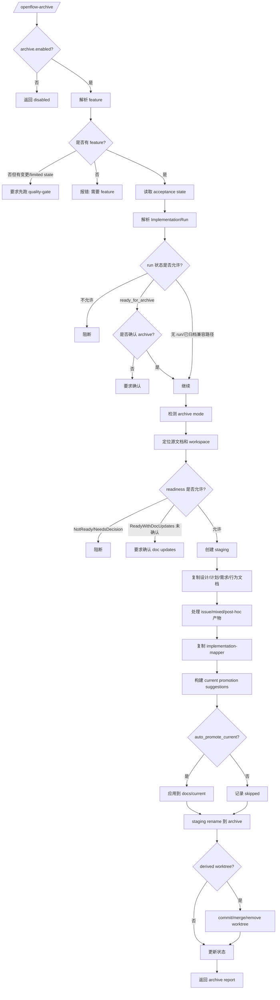

# Archive 工作节点工作流

## 1. 节点定位

`archive` 是把已验证变更固化为 canonical 事实的节点。代码入口是 `src/commands/archive.ts` 的 `handleArchive`。

这个节点不负责证明实现正确。证明工作由 quality-gate 完成。archive 只在 readiness 允许时，把 change workspace、行为映射、issue/mixed 产物和 current promotion 结果冻结到 archive，并处理 worktree 收尾。

## 2. 给人看的流程图

## 3. 给人和 AI 执行的流程说明

1. 用户运行 `/openflow-archive <feature>`。
2. 系统检查 archive 是否启用。
3. 如果 archive 禁用：
   - 返回 disabled。
   - 不读取 acceptance state。
   - 不写 archive 目录。
4. 系统解析 feature。
5. 解析顺序是：
   - 显式命令参数。
   - active feature。
6. 如果没有解析到 feature：
   - 系统检查 acceptance state 是否是 limited-context。
   - 系统检查是否有代码变更。
7. 如果没有 feature 但存在 limited-context state 或代码变更：
   - 返回 quality-gate first block。
   - 要求先运行 quality-gate。
8. 如果没有 feature 且没有可归档上下文：
   - 抛出错误。
   - 提示用法 `/openflow-archive <feature-name>`。
9. 如果 feature 存在：
   - 系统清洗 feature slug。
   - 读取 acceptance state。
10. 系统解析 ImplementationRun。
11. 如果存在 ImplementationRun，且 run 的 execution root 和当前目录不匹配：
   - archive 阻断。
   - 不复制文档。
   - 不合并 worktree。
12. 如果 run 状态是 `ready_for_archive`：
   - 系统检查是否已有 archive run confirmation。
13. 如果尚未确认：
   - 系统设置 awaiting confirmation。
   - 返回确认提示。
   - 不执行归档。
14. 如果 run 状态不是 `ready_for_archive`，也不是 `archived`：
   - archive 阻断。
   - 提示先完成 quality-gate。
15. 如果 run 已 archived：
   - 系统按已归档状态处理，不重复创建新的归档周期。
16. 系统检测 archive mode。
17. archive mode 可能是：
   - `feature`。
   - `issue`。
   - `mixed`。
18. 系统定位源文件：
   - change workspace。
   - change plan。
   - design document。
   - requirements/prd document。
   - behavior document。
   - issue clarification。
   - promotion candidate。
   - issue resolution。
   - implementation mapper。
19. 系统读取 readiness。
20. 如果 quality-gate applicability 不允许 archive readiness：
   - archive 阻断。
   - 返回 applicability block。
21. 如果 readiness 是 `NotReady`：
   - archive 阻断。
   - 用户必须修复问题并重新跑 quality-gate。
22. 如果 readiness 是 `NeedsDecision`：
   - archive 阻断。
   - 用户必须先解决决策问题。
23. 如果 harden summary 中有 unresolved must-fix：
   - archive 阻断。
24. 如果 harden summary 中有 unresolved needs-decision：
   - archive 阻断。
25. 如果 readiness 是 `ReadyWithDocUpdates`：
   - 系统检查 pending doc updates 是否已确认。
26. 如果 pending doc updates 未确认，且不是 accepted known issues 路径：
   - archive 设置等待确认。
   - 返回 doc update confirmation required。
   - 不执行归档。
27. 如果 implementation state 不是 clean 或 verified：
   - archive 阻断。
28. 系统收集变更文件：
   - build changes。
   - session file changes。
   - phased session changes。
29. 系统进行 drift 检查。
30. 如果 legacy readiness fallback 且存在 drift：
   - archive 阻断并要求决策。
31. 系统创建 staging archive 目录。
32. 系统复制 feature 产物：
   - `design.md`。
   - `plan.md`。
   - `prd.md`。
   - `behavior.md`。
   - `proposal.md`。
   - `decisions.md`。
33. 如果 source change workspace 有 `implementation-mapper.md`：
   - 复制到 staging。
34. 如果 archive mode 是 issue 或 mixed：
   - 复制 `issue-clarification.md`。
   - 复制 promotion candidate。
   - 如果已有 `issue-resolution.md`，复制它。
   - 如果没有，生成 `issue-resolution.md`。
35. 如果是 post-hoc issue ready：
   - 生成 post-hoc issue artifacts。
36. 系统构建 current promotion suggestions。
37. 如果 `archive.auto_promote_current` 为 true：
   - 同步应用 promotion suggestions 到 `docs/current/`。
38. 如果 `archive.auto_promote_current` 为 false：
   - 不修改 `docs/current/`。
   - 把 suggestions 作为 skipped 结果报告。
39. 所有 staging 操作成功后：
   - 系统创建 archive root。
   - 将 staging rename 到最终 archive 目录。
40. 如果使用 derived worktree：
   - 在 worktree 内 `git add -A`。
   - 创建 archive commit。
   - 获取 commit hash。
41. 如果 archive commit 成功：
   - 尝试把 worktree branch merge 回主仓库。
   - 尝试删除 worktree。
   - 尝试删除 worktree branch。
42. 如果 merge 或 cleanup 失败：
   - 记录 warning。
   - 报告中必须体现 cleanup/merge 状态。
43. 系统更新 acceptance state 和 ImplementationRun。
44. 系统清理 build data。
45. 系统返回 archive report。

## 4. quality-gate 与 archive 的边界

1. quality-gate 负责证明 readiness。
2. archive 负责 canonicalization。
3. archive 不重新运行 harden。
4. archive 不重新运行 verify。
5. archive 不因为用户要求归档就跳过 readiness。
6. archive 只消费 acceptance state、readiness、harden summary、run 状态和源文档。

## 5. implementation-mapper 规则

1. `implementation-mapper.md` 通常由 quality-gate 在 Ready / ReadyWithDocUpdates 且存在 `behavior.md` 时生成。
2. archive 只复制已有 mapper。
3. mapper 的意义是把 behavior scenario 和关键代码文件建立可追溯关系。
4. 如果 mapper 缺失，archive 可能继续，但文档应提示 traceability 证据不足。

## 6. current promotion 规则

1. archive 会构建 promotion suggestions。
2. 如果配置允许 auto promote：
   - archive 同步修改 `docs/current/`。
   - 这是归档原子操作的一部分。
3. 如果配置不允许 auto promote：
   - archive 不修改 `docs/current/`。
   - suggestions 留作后续人工处理。
4. archive 不应静默丢弃 promotion suggestions。

## 7. 产物

1. 最终 archive 目录：
   - `docs/archive/{date-feature}/` 或配置指定路径。
2. 归档副本可能包括：
   - `design.md`。
   - `plan.md`。
   - `prd.md`。
   - `behavior.md`。
   - `proposal.md`。
   - `decisions.md`。
   - `implementation-mapper.md`。
   - `issue-clarification.md`。
   - `issue-resolution.md`。
   - promotion candidate。
3. 状态更新：
   - acceptance state。
   - ImplementationRun。
4. worktree 模式下可能产生：
   - archive commit。
   - merge 记录。
   - worktree cleanup 结果。

## 8. 禁止事项

1. 不要在 NotReady 时归档。
2. 不要在 NeedsDecision 时归档。
3. 不要忽略 harden unresolved must-fix。
4. 不要忽略 harden unresolved needs-decision。
5. 不要跳过 archive confirmation。
6. 不要在 execution root mismatch 时归档。
7. 不要把 archive 当成 verify 的替代品。
8. 不要在 staging 未完成时写最终 archive 目录。
9. 不要静默修改 `docs/current/`；必须受 `auto_promote_current` 控制。

## 9. 与代码对照清单

| 文档规则 | 代码依据 | 漂移检查 |
|---|---|---|
| 入口 | `src/commands/archive.ts` | `handleArchive(ctx, feature?)` 仍是入口 |
| feature 解析 | `stripOpenFlowCommandTokens()` + `findActiveFeature()` | 无 feature fallback 仍存在 |
| quality-gate first block | `formatQualityGateFirstBlock()` | limited/context code changes 仍先要求 gate |
| run/root 匹配 | `hasArchiveExecutionRootMismatch()` | mismatch 仍阻断 |
| run 状态门槛 | `resolveArchiveImplementationRun()` | 非 ready_for_archive 仍阻断 |
| readiness 门槛 | `VerifyReadinessStatus` 分支 | NotReady/NeedsDecision 仍阻断 |
| harden 阻断 | `hardenTerminalSummary` 检查 | unresolved must-fix / needs-decision 仍阻断 |
| staging 原子化 | `buildStagingArchiveDir()` + `fs.rename()` | 仍先 staging 再 rename |
| current promotion | `buildPromotionSuggestions()` / `applyPromotionSuggestions()` | 仍受 `auto_promote_current` 控制 |
| worktree cleanup | `removeWorktree()` | derived worktree 仍 commit/merge/cleanup |

## 10. 漂移风险提示

如果 archive readiness 规则、ImplementationRun 状态名、accepted known issues 处理、doc update confirmation、current promotion、worktree merge/cleanup 或 archive artifact 文件名变化，本文件必须同步更新。重点检查 `src/commands/archive.ts`、`src/phases/archive/index.ts`、`src/utils/acceptance-state.ts`、`src/utils/implementation-worktree.ts`。
