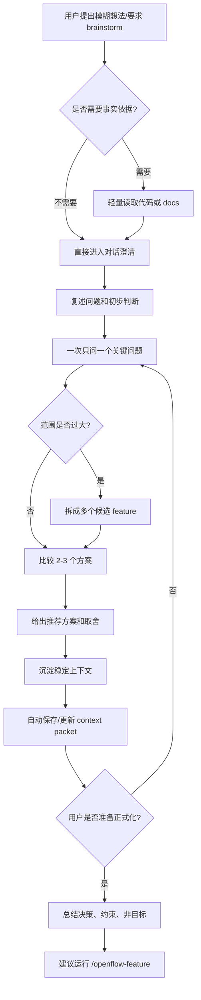

# Brainstorm 工作节点工作流

## 1. 节点定位

`brainstorm` 是正式 OpenFlow feature 工作流之前的探索节点。它的代码入口是 `src/skills/brainstorm-skill.ts` 注册的 `openflow-brainstorm` Skill。

这个节点的目标不是产出正式文档，而是让用户和 AI 在低成本对话里把问题、约束、非目标、方案取舍先说清楚。等上下文稳定后，再交给 `/openflow-feature` 生成正式的 `design.md` 和 `behavior.md`。

## 2. 给人看的流程图

## 3. 给人和 AI 执行的流程说明

1. 用户提出一个还不适合直接实现的想法。
2. AI 先判断这个想法是否需要事实依据。
3. 如果不需要事实依据：
   - 直接围绕用户输入展开讨论。
   - 不做代码审计。
   - 不启动正式 feature、plan、implement 流程。
4. 如果需要事实依据：
   - 只读取能支撑当前判断的代码或 `docs/*.md`。
   - 不进行与问题无关的全仓搜索。
   - 读取结果只用于澄清讨论，不直接生成正式产物。
5. AI 复述用户的想法，并给出初步判断：
   - 这个问题大致属于什么类型。
   - 可能影响哪些用户或流程。
   - 当前最不确定的点是什么。
6. AI 每次只问一个问题。
7. 如果问题范围过大：
   - AI 必须把它拆成多个更小的 feature 候选。
   - 每个候选应能独立设计、独立计划、独立实现、独立验证。
   - 不应把产品方向、架构重构、实现计划混成一个 feature。
8. 如果问题范围足够小：
   - AI 提出 2-3 个可选方案。
   - 每个方案说明它优化什么、牺牲什么、风险在哪里。
   - 如果已有代码模式或文档规则，应说明推荐方案如何贴合现有模式。
9. 当出现稳定信息时，AI 把它们沉淀为上下文：
   - 问题或目标。
   - 已做决策。
   - 必须遵守的约束。
   - 明确不做的非目标。
   - 风险、例子、待确认问题。
10. 系统可将稳定上下文保存为 brainstorm context packet。
11. context packet 默认用于后续 `/openflow-feature`：
   - 用户不需要把 brainstorm 结论手动复制给 feature 节点。
   - feature 节点会在正式设计前尝试 harvest 这些上下文。
12. 如果用户还没准备正式化：
   - 继续对话。
   - 继续一次一个问题地收敛。
13. 如果用户准备正式化：
   - AI 总结问题、决策、约束、非目标和风险。
   - AI 建议运行 `/openflow-feature <name>`。
   - brainstorm 节点到此结束。

## 4. 产物

1. brainstorm 节点可以产生：
   - 对话中的方案比较。
   - 对话中的推荐方案。
   - `.sisyphus/brainstorm/context-packets/` 下的 context packet。
2. brainstorm 节点不产生：
   - `docs/changes/.../design.md`。
   - `docs/changes/.../behavior.md`。
   - `docs/changes/.../plan.md`。
   - `.sisyphus/plans/{feature}.md`。
   - ImplementationRun。

## 5. 禁止事项

1. 不要把 brainstorm 当成实现计划生成器。
2. 不要在 brainstorm 中写正式设计文档。
3. 不要从 brainstorm 直接进入代码实现。
4. 不要为了普通探索启动 harden、verify、quality-gate 或 archive。
5. 不要用一次性长问卷压迫用户；每轮只问一个关键问题。
6. 不要在没有用户准备正式化时自动运行 `/openflow-feature`。

## 6. 与代码对照清单

| 文档规则 | 代码依据 | 漂移检查 |
|---|---|---|
| brainstorm 是 Skill，不是 command | `src/skills/brainstorm-skill.ts`, `src/commands/manifest.ts` | `OPENFLOW_REGISTERED_SKILL_NAMES` 包含 `openflow-brainstorm` |
| 不生成正式文档 | `getBrainstormSkill()` 的 Boundaries | 文档不得声称 brainstorm 写 `design.md` / `plan.md` |
| 自动保存 context packet | `getBrainstormSkill()` 的 Automatic Context Preservation | 文档只说保存上下文，不说它等于 FeatureSession |
| 转入 feature | `getBrainstormSkill()` 的 Transition To Feature Workflow | 文档只建议 `/openflow-feature`，不自动执行 |

## 7. 漂移风险提示

如果以后代码把 brainstorm 从 Skill 改成 slash command，或把 context packet 的目录、字段、触发方式改掉，本文件必须同步更新。特别要检查 `src/skills/brainstorm-skill.ts` 与 `src/commands/manifest.ts`。
