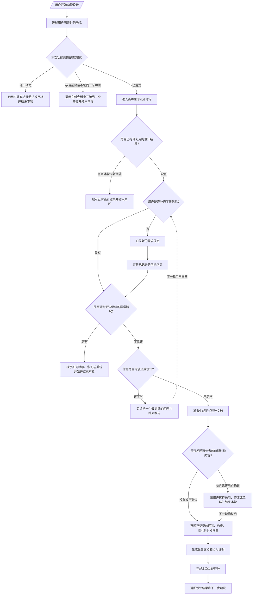

# Feature 工作节点工作流

本文说明 `/openflow-feature` 这一工作节点的当前行为。它面向两类读者：

- **普通使用者**：理解什么时候会进入功能设计、系统会问什么、最终会得到什么。
- **维护者**：确认当前边界、失败恢复方式，以及它和后续 writing-plan 的衔接规则。

本文描述的是当前有效流程；如果历史文档或旧设计中出现不同说法，以本文为准。

## 1. 节点定位

Feature 工作节点负责把一个“想做什么功能”的自然语言想法，逐步整理成可评审、可交接的正式设计说明。

它主要做三件事：

1. **确认功能身份**：判断本轮讨论的是哪个功能，避免同一个会话里混入另一个功能。
2. **收集关键设计信息**：围绕问题、使用者、范围、优先级和约束，尽量只追问最关键的问题。
3. **生成设计产物**：在信息足够时，整理用户回答、约束、假设和确认采用的前期讨论内容，生成设计文档和行为说明。

它不会直接进入实现阶段，也不会自动生成开发计划、启动实现或归档。完成设计后，系统只会提示下一步可以进入 writing-plan。

## 2. 当前流程图



图中的虚线表示跨轮继续：本轮先返回问题或确认提示，等用户下一轮回答后，再继续处理。系统会把用户已经回答的内容、明确的约束、暂定的假设，以及用户确认采用的前期讨论内容一起整理成正式设计。

## 3. 功能身份如何确定

Feature 节点首先要确认“这次到底是在设计哪个功能”。这是为了避免同一段对话里混入多个互不相关的功能，导致后续设计文档边界不清。

当前规则如下：

1. **用户明确描述了功能**：系统会从这段自然语言中提取功能名称和主题。
2. **用户是在继续当前功能**：如果当前会话已经绑定了一个功能，系统会优先继续这个功能。
3. **用户尝试在同一会话切换到另一个功能**：系统会阻止切换，并提示应在新会话中开始另一个功能。
4. **功能意图太泛或太模糊**：系统不会强行生成设计，而是要求用户补充更清楚的功能想法或目标。

对于中文或中英混合输入，系统会尽量从自然语言中提取关键词，形成内部可识别的功能名称；用户不需要手动提供 slug。

## 4. 多轮设计讨论如何推进

Feature 设计不是一次性表单，而是多轮澄清流程。每一轮只做一件事：处理用户刚刚提供的信息，然后判断是否已经足够生成设计。

系统会围绕五类核心信息推进：

1. **问题**：这个功能主要要解决什么问题？
2. **使用者**：主要使用者是谁？
3. **范围**：这次功能边界大概在哪里？
4. **优先级**：最重要的是速度、体验、准确性、安全性，还是其他目标？
5. **约束**：有什么必须遵守或必须避免的限制？

系统不会机械地把所有问题都问一遍。它会根据已有信息判断哪些内容已经足够清楚，哪些可以从上下文合理推断，哪些仍然缺失。需要继续追问时，它会尽量只问一个最可能影响设计方向的问题。

如果用户明确表示“先继续”“先生成草稿”“后面再补”，系统可以带着假设生成草稿式设计；这类设计会保留未确认事项，提醒后续评审时重点确认。

## 5. 已记录信息与状态文件

用户每次提供有效回答后，系统都会更新已记录的功能信息，并同步生成一份可读的状态说明。

这份状态说明的作用是：

- 让用户和维护者看到当前已经收集了哪些回答。
- 记录当前假设和仍需确认的问题。
- 作为后续流程判断“设计是否已完成”的辅助依据。

需要注意的是，状态说明是“当前记录的可读呈现”，不是要求用户手工维护的输入文件。用户继续用自然语言回答即可，不需要直接编辑它。

## 6. 前期讨论内容如何使用

当系统准备生成正式设计时，会检查是否存在可参考的前期讨论内容，例如 brainstorm 阶段整理出的背景、约束、风险、例子或开放问题。

如果发现相关内容，系统不会默认全部采用，而是让用户选择：

- **采用**：把这些内容纳入本次设计。
- **修改**：只采用其中一部分，或按用户补充的说法修订后采用。
- **忽略**：不把这份前期讨论内容用于本次设计。

如果前期讨论内容里还有未解决的开放问题，系统会阻止直接生成最终设计，除非用户先回答这些问题，或明确接受“带假设的草稿”。这样可以避免把明显未确认的内容包装成已经确定的设计结论。

如果查找前期讨论内容时出现异常，系统会采用安全降级策略：忽略这一步，继续根据当前已记录信息生成设计。

## 7. 设计产物

设计完成后，当前流程会生成三类文件：

- `state.md`：当前功能状态摘要。
- `design.md`：正式设计说明。
- `behavior.md`：用户可见行为、触发规则和验收映射。

其中 `design.md` 通常说明：

- 功能背景和问题。
- 目标与非目标。
- 关键约束。
- 成功标准。
- 风险与缓解方式。
- 测试或验证思路。

`behavior.md` 通常说明：

- 用户在什么情况下会触发这个功能。
- 哪些情况不应该触发。
- 用户会看到什么结果。
- 必须包含和必须避免的行为。
- 行为与验收标准之间的对应关系。

如果本次设计是带假设生成的草稿，设计文档和行为说明都会明确提示哪些内容尚未完全确认。

当前 Feature 节点不会生成 `proposal.md`、`requirements.json` 或额外的 metadata 文件。

## 8. 设计自检

生成设计文档时，系统会追加一段 Cross-Validation Summary，用来检查文档之间是否存在明显缺口。

自检重点包括：

- 是否还残留 `TBD`、`TODO`、`待定`、`待补充` 等占位内容。
- 设计说明是否包含基本概述。
- 行为说明是否覆盖用户可见场景。
- 约束与行为是否基本对齐。
- 如果涉及删除数据、敏感凭据、权限、自动执行、跨会话状态等高风险内容，是否有相应防护说明。

自检结果可能是：

- `Passed`：可以进入下一步。
- `Blocking`：存在阻断问题，需要先修正文档。
- `Critical Blocking`：存在严重阻断问题，不应进入后续计划或实现。

这一步不是完整人工评审的替代品；它只是帮助提前发现明显不一致或风险遗漏。

## 9. 完成后用户会看到什么

设计成功生成后，系统会返回完成提示，并列出生成的设计文档和行为说明。

如果当前环境支持交互选择，系统会提供下一步选项，例如：

- 进入计划编写。
- 查看生成文档。
- 检查当前结果。

如果选择进入计划编写，系统只会提示用户手动运行：

```text
/openflow-writing-plan <feature>
```

当前 Feature 节点不会自动调用 writing-plan。这样做是为了让用户先有机会阅读和确认设计，再决定是否进入开发计划阶段。

## 10. writing-plan 的进入条件

`/openflow-writing-plan` 依赖 Feature 阶段生成的设计结果。进入 writing-plan 前，系统会检查：

1. 能唯一定位到当前功能的设计工作区。
2. 已存在 `design.md`。
3. 已存在 `behavior.md`。
4. `design.md` 中包含 Cross-Validation Summary，并且结果为 `Passed`。
5. `state.md` 存在，并显示该功能设计已经完成。

只有这些条件满足后，writing-plan 才会读取设计说明和行为说明，整理成开发计划所需的上下文。

## 11. 自动触发与生命周期提示

OpenFlow 可能根据用户表达判断“这看起来像一个需要正式设计的功能”，并给出 `/openflow-feature` 的建议。

这个提示只是建议，不会自动替用户开始设计，也不会阻止正常的研究、阅读或实现工具继续工作。只有用户明确运行 `/openflow-feature`，Feature 工作节点才会正式介入。

系统还会短时间记住当前会话正在处理哪个功能，以及刚刚完成的功能设计。这样可以减少重复询问，也能在用户继续同一个话题时自动接上上下文。

## 12. 失败与恢复

如果设计生成失败，系统会记录失败状态，并提示用户继续运行同一个功能设计命令尝试恢复。

如果当前状态已经无法安全继续，例如生成失败且没有可复用的设计产物，或草稿被阻断，系统不会静默重试。它会明确提示用户：

1. 在新会话中重新描述这个功能。
2. 或由维护者清理对应的功能状态后再重试。

这样可以避免在状态不完整或不可信的情况下继续生成错误设计。

## 13. 当前边界

按当前流程，Feature 工作节点不负责：

- 自动编写开发计划。
- 自动实现功能。
- 自动归档。
- 在同一会话中切换到另一个功能。
- 把未确认的前期讨论内容直接当作最终设计结论。

它的职责边界可以概括为：**把功能想法澄清成正式设计；设计完成后，把下一步选择权交还给用户。**

## 14. 维护者参考

本文主要依据当前实现与相关测试更新，关键实现位置包括：

- `src/commands/feature.ts`
- `src/phases/feature/state-machine.ts`
- `src/phases/feature/convergence.ts`
- `src/phases/feature/context-harvest.ts`
- `src/phases/feature/design-renderer.ts`
- `src/phases/feature/behavior-renderer.ts`
- `src/commands/writing-plan.ts`
- `src/hooks/feature-workflow.ts`

如果后续实现与本文描述不一致，应优先更新本文或修正实现，避免流程图、用户说明与实际行为发生漂移。
