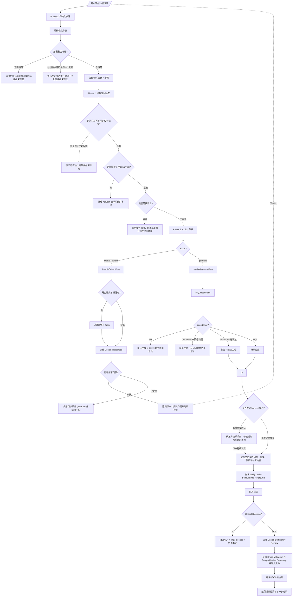

# Feature 工作节点工作流

本文说明 `/openflow-feature` 这一工作节点的当前行为。它面向两类读者：

- **普通使用者**：理解什么时候会进入功能设计、系统会问什么、最终会得到什么。
- **维护者**：确认当前边界、失败恢复方式，以及它和后续 writing-plan 的衔接规则。

本文描述的是当前有效流程；如果历史文档或旧设计中出现不同说法，以本文为准。

## 1. 节点定位

Feature 工作节点负责把一个“想做什么功能”的自然语言想法，逐步整理成可评审、可交接的正式设计说明。

它主要做三件事：

1. **确认功能身份**：判断本轮讨论的是哪个功能，避免同一个会话里混入另一个功能。
2. **收集关键设计信息**：围绕问题、使用者、范围、优先级和约束，尽量只追问最关键的问题。
3. **生成设计产物**：在信息足够时，整理用户回答、约束、假设和确认采用的前期讨论内容，生成设计文档和行为说明。

它不会直接进入实现阶段，也不会自动生成开发计划、启动实现或归档。完成设计后，系统只会提示下一步可以进入 writing-plan。

## 2. 当前流程图


```mermaid
flowchart TD
    A[/用户开始功能设计/] --> B[Phase 1: 初始化会话]
    B --> B1[解析功能身份]
    B1 --> B2{意图是否清楚?}
    B2 -->|还不清楚| D[请用户补充功能想法或目标并结束本轮]
    B2 -->|与当前会话不是同一个功能| E[提示在新会话中开始另一个功能并结束本轮]
    B2 -->|已清楚| B3[加载/合并会话 + 绑定]
    B3 --> C[Phase 2: 早期返回检查]
    C --> C1{是否已有可复用的设计结果?}
    C1 -->|有且本轮无新回答| H[展示已有设计结果并结束本轮]
    C1 -->|没有| C2{是否有待处理的 harvest?}
    C2 -->|有| R1[处理 harvest 选择并结束本轮]
    C2 -->|没有| C3{是否需要恢复?}
    C3 -->|需要| M[提示如何继续、恢复或重新开始并结束本轮]
    C3 -->|不需要| F[Phase 3: Action 分发]
    F --> F1{action?}
    F1 -->|status / collect| I[handleCollectFlow]
    F1 -->|generate| P[handleGenerateFlow]

    I --> I1{是否补充了新信息?}
    I1 -->|有| J[记录并保存 facts]
    I1 -->|没有| K[评估 Design Readiness]
    J --> K
    K --> K1{信息是否足够?}
    K1 -->|不够| O[追问下一个关键问题并结束本轮]
    O -.下一轮.-> A
    K1 -->|已足够| O2[提示可以调用 generate 并结束本轮]

    P --> P1[评估 Readiness]
    P1 --> P2{confidence?}
    P2 -->|low| P3[阻止生成 + 追问问题并结束本轮]
    P2 -->|medium + 未回答问题| P4[阻止生成 + 追问问题并结束本轮]
    P2 -->|medium + 已跳过| P5[警告 + 继续生成]
    P2 -->|high| P6[继续生成]
    P5 --> Q
    P6 --> Q
    Q --> Q1{是否发现 harvest 候选?}
    Q1 -->|有且需要确认| R[请用户选择采用、修改或忽略并结束本轮]
    Q1 -->|没有或已确认| S[整理已记录的回答、约束、假设和参考内容]
    R -.下一轮确认后.-> S
    S --> T[生成 design.md + behavior.md + state.md]
    T --> T1[交叉验证]
    T1 --> T2{Critical Blocking?}
    T2 -->|有| T3[阻止写入 + 标记 blocked + 结束本轮]
    T2 -->|没有| T4[执行 Design Sufficiency Review]
    T4 --> T5[追加 Cross-Validation 与 Design Review Summary 并写入文件]
    T5 --> U[完成本次功能设计]
    U --> V[返回设计结果和下一步建议]
```

图中的虚线表示跨轮继续：本轮先返回问题或确认提示，等用户下一轮回答后，再继续处理。系统会把用户已经回答的内容、明确的约束、暂定的假设，以及用户确认采用的前期讨论内容一起整理成正式设计。

## 3. 功能身份如何确定

Feature 节点首先要确认“这次到底是在设计哪个功能”。这是为了避免同一段对话里混入多个互不相关的功能，导致后续设计文档边界不清。

当前规则如下：

1. **用户明确描述了功能**：系统会从这段自然语言中提取功能名称和主题。
2. **用户是在继续当前功能**：如果当前会话已经绑定了一个功能，系统会优先继续这个功能。
3. **用户尝试在同一会话切换到另一个功能**：系统会阻止切换，并提示应在新会话中开始另一个功能。
4. **功能意图太泛或太模糊**：系统不会强行生成设计，而是要求用户补充更清楚的功能想法或目标。

对于中文或中英混合输入，系统会尽量从自然语言中提取关键词，形成内部可识别的功能名称；用户不需要手动提供 slug。

## 4. 多轮设计讨论如何推进

Feature 设计不是一次性表单，而是多轮澄清流程。每一轮只做一件事：处理用户刚刚提供的信息，然后判断是否已经足够生成设计。

系统会围绕五类核心信息推进：

1. **问题**：这个功能主要要解决什么问题？
2. **使用者**：主要使用者是谁？
3. **范围**：这次功能边界大概在哪里？
4. **优先级**：最重要的是速度、体验、准确性、安全性，还是其他目标？
5. **约束**：有什么必须遵守或必须避免的限制？

系统不会机械地把所有问题都问一遍。当前流程通过 **Question Engine** 维护一个固定的问题序列（problem → scope → target-users → priority → constraints），根据 `collectedFacts` 中已经记录的字段判断哪些问题已回答，然后只返回下一个最关键的问题。

同时，**Readiness Evaluator** 会对当前收集的信息进行综合评估，返回 `low` / `medium` / `high` 三个等级：

- **low**：核心事实（如问题描述）严重缺失，无法生成可靠设计。
- **medium**：核心事实基本具备，但部分推荐问题（如优先级、约束）尚未回答。此时系统允许生成，但会追加警告。
- **high**：信息充分，可以直接生成设计。

如果用户在 medium 阶段明确表示“先继续”“先生成草稿”“后面再补”，系统可以带着假设生成草稿式设计；这类设计会保留未确认事项，提醒后续评审时重点确认。用户也可以通过 `action='collect' facts={"skip-questions": "yes"}` 显式跳过未回答的问题。

## 5. 已记录信息与状态文件

用户每次提供有效回答后，系统都会更新已记录的功能信息，并同步生成一份可读的状态说明。

这份状态说明的作用是：

- 让用户和维护者看到当前已经收集了哪些回答。
- 记录当前假设和仍需确认的问题。
- 作为后续流程判断“设计是否已完成”的辅助依据。

需要注意的是，状态说明是“当前记录的可读呈现”，不是要求用户手工维护的输入文件。用户继续用自然语言回答即可，不需要直接编辑它。

## 6. 前期讨论内容如何使用

当系统准备生成正式设计时，会检查是否存在可参考的前期讨论内容，例如 brainstorm 阶段整理出的背景、约束、风险、例子或开放问题。

如果发现相关内容，系统不会默认全部采用，而是让用户选择：

- **采用**：把这些内容纳入本次设计。
- **修改**：只采用其中一部分，或按用户补充的说法修订后采用。
- **忽略**：不把这份前期讨论内容用于本次设计。

如果前期讨论内容里还有未解决的开放问题，系统会阻止直接生成最终设计，除非用户先回答这些问题，或明确接受“带假设的草稿”。这样可以避免把明显未确认的内容包装成已经确定的设计结论。

如果查找前期讨论内容时出现异常，系统会采用安全降级策略：忽略这一步，继续根据当前已记录信息生成设计。

## 7. 设计产物

设计完成后，当前流程会生成三类文件：

- `state.md`：当前功能状态摘要。
- `design.md`：正式设计说明。
- `behavior.md`：用户可见行为、触发规则和验收映射。

其中 `design.md` 通常说明：

- 功能背景和问题。
- 目标与非目标。
- 关键约束。
- 成功标准。
- 风险与缓解方式。
- 测试或验证思路。

`behavior.md` 通常说明：

- 用户在什么情况下会触发这个功能。
- 哪些情况不应该触发。
- 用户会看到什么结果。
- 必须包含和必须避免的行为。
- 行为与验收标准之间的对应关系。

如果本次设计是带假设生成的草稿，设计文档和行为说明都会明确提示哪些内容尚未完全确认。

当前 Feature 节点不会生成 `proposal.md`、`requirements.json` 或额外的 metadata 文件。

## 8. 设计自检与充分性审查

生成设计文档时，系统会执行两类检查：

1. **Cross-Validation Summary**：检查文档结构、安全底线和明显交叉引用缺口。
2. **Design Sufficiency Review**：检查设计是否已经足够支撑实现计划，尤其是关键约束是否具备 owner、trigger、operation、state/output、failure semantics、verification 和 compatibility boundary。

两者职责不同：Cross-validation passed 只表示文档可以安全写入；不代表设计已经足够进入 implementation planning。

自检重点包括：

- 是否还残留 `TBD`、`TODO`、`待定`、`待补充` 等占位内容。
- 设计说明是否包含基本概述。
- 行为说明是否覆盖用户可见场景。
- 约束与行为是否基本对齐。
- 如果涉及删除数据、敏感凭据、权限、自动执行、跨会话状态等高风险内容，是否有相应防护说明。

Cross-validation 结果可能是：

- `Passed`：可以进入下一步。
- `Blocking`：存在阻断问题，需要先修正文档。
- `Critical Blocking`：存在严重阻断问题（如数据删除无备份、敏感凭据无权限控制、自动执行无防护、全局状态变更无隔离等），系统会**阻止文档写入**，标记 session 为 `draft_blocked`，并要求用户先解决这些安全问题后再重试生成。

这一步不是完整人工评审的替代品；它只是帮助提前发现明显不一致或风险遗漏。当 Critical Blocking 被触发时，设计产物不会被写入磁盘，避免带严重安全缺陷的文档进入后续流程。

Design Sufficiency Review 不会因为约束不足而阻止写入文档；它会把结果追加到 `design.md` 和 `behavior.md` 末尾，并把 readiness 标记为：

- `ready_for_planning`：可以进入 writing-plan。
- `needs_implementation_constraints`：结构完整，但实现约束不足。
- `needs_behavior_examples`：缺少足够可观察行为例子。
- `needs_data_contracts`：涉及输出、payload、兼容或数据结构，但没有足够 contract。
- `needs_failure_semantics`：涉及任务、状态或自动执行，但缺少失败、超时、中断、取消语义。
- `not_ready`：结构或语义不足，不应进入 planning。

当 Design Sufficiency Review 为 `not_ready` 时，Feature 节点仍会写出文档供继续编辑和补充 facts，但下一步建议会变为“补充实现约束 / 查看充分性报告 / 检查产物”，而不是直接进入 writing-plan。

## 9. 完成后用户会看到什么

设计成功生成后，系统会返回完成提示，并列出生成的设计文档和行为说明。

如果当前环境支持交互选择，系统会根据 Design Sufficiency Review 提供下一步选项。

当 review 为 ready 时，例如：

- 进入计划编写。
- 查看生成文档。
- 检查当前结果。

当 review 为 not ready 时，例如：

- 补充缺失的实现约束。
- 查看 Design Sufficiency Review。
- 检查生成产物。

如果选择进入计划编写，系统只会提示用户手动运行：

```text
/openflow-writing-plan <feature>
```

当前 Feature 节点不会自动调用 writing-plan。这样做是为了让用户先有机会阅读和确认设计，再决定是否进入开发计划阶段。

## 10. writing-plan 的进入条件

`/openflow-writing-plan` 依赖 Feature 阶段生成的设计结果。进入 writing-plan 前，系统会检查：

1. 能唯一定位到当前功能的设计工作区。
2. 已存在 `design.md`。
3. 已存在 `behavior.md`。
4. `design.md` 中包含 Cross-Validation Summary，并且结果为 `Passed`。
5. `design.md` 或 `behavior.md` 中包含 Design Sufficiency Review，并且 Design Readiness 为 `ready_for_planning`。
6. `state.md` 存在，并显示该功能设计已经完成。

只有这些条件满足后，writing-plan 才应读取设计说明和行为说明，整理成开发计划所需的上下文。如果 Cross-Validation 已通过但 Design Sufficiency Review 仍为 not ready，应先补充缺失 facts 或实现约束，再重新生成设计文档。

## 11. 自动触发与生命周期提示

OpenFlow 可能根据用户表达判断“这看起来像一个需要正式设计的功能”，并给出 `/openflow-feature` 的建议。

这个提示只是建议，不会自动替用户开始设计，也不会阻止正常的研究、阅读或实现工具继续工作。只有用户明确运行 `/openflow-feature`，Feature 工作节点才会正式介入。

系统还会短时间记住当前会话正在处理哪个功能，以及刚刚完成的功能设计。这样可以减少重复询问，也能在用户继续同一个话题时自动接上上下文。

## 12. 失败与恢复

如果设计生成失败，系统会记录失败状态，并提示用户继续运行同一个功能设计命令尝试恢复。

如果当前状态已经无法安全继续，例如生成失败且没有可复用的设计产物，或草稿被阻断，系统不会静默重试。它会明确提示用户：

1. 在新会话中重新描述这个功能。
2. 或由维护者清理对应的功能状态后再重试。

这样可以避免在状态不完整或不可信的情况下继续生成错误设计。

## 13. 当前边界

按当前流程，Feature 工作节点不负责：

- 自动编写开发计划。
- 自动实现功能。
- 自动归档。
- 在同一会话中切换到另一个功能。
- 把未确认的前期讨论内容直接当作最终设计结论。

它的职责边界可以概括为：**把功能想法澄清成正式设计；设计完成后，把下一步选择权交还给用户。**

## 14. 维护者参考

本文主要依据当前实现与相关测试更新，关键实现位置包括：

**入口与编排：**
- `src/commands/feature.ts`
- `src/phases/feature/workflow/feature-workflow.ts`
- `src/phases/feature/workflow/finalization.ts`
- `src/hooks/feature-workflow.ts`

**状态与会话：**
- `src/phases/feature/state-machine.ts`
- `src/phases/feature/workflow/infra/session-store.ts`

**收敛与问题引导：**
- `src/phases/feature/readiness-evaluator.ts`
- `src/phases/feature/question-engine.ts`

**文档生成：**
- `src/phases/feature/workflow/rules/generation.ts`
- `src/phases/feature/workflow/rules/cross-validation.ts`
- `src/phases/feature/design-renderer.ts`
- `src/phases/feature/behavior-renderer.ts`
- `src/phases/feature/workflow/rules/state-document.ts`

**PRD 与决策文档：**
- `src/phases/feature/prd-generator.ts`
- `src/phases/feature/workflow/rules/prd-template.ts`
- `src/phases/feature/workflow/rules/prd-extractor.ts`
- `src/phases/feature/workflow/rules/prd-utils.ts`

**上下文采集：**
- `src/phases/feature/context-harvest.ts`

**下游衔接：**
- `src/commands/writing-plan.ts`
- `src/utils/markdown-helpers.ts`

如果后续实现与本文描述不一致，应优先更新本文或修正实现，避免流程图、用户说明与实际行为发生漂移。
