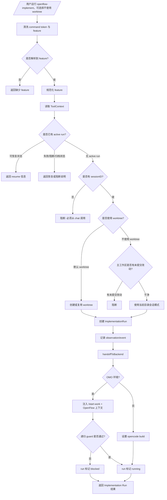

# Implement 工作节点工作流

## 1. 节点定位

`implement` 是受治理的实现启动节点。代码入口是 `src/commands/implement.ts` 的 `handleImplement`，后端分流在 `src/utils/implementation-backend.ts`。

这个节点的职责不是“让 AI 开始随便改代码”，而是创建或恢复 `ImplementationRun`，确定执行根目录，建立 worktree/session 隔离，并把完整实现上下文交给 OMO 或 OpenCode。

## 2. 流程图

## 3. 给人和 AI 执行的流程说明

1. 用户运行 `/openflow-implement <feature>`。
2. 系统先清洗输入：
   - 去掉 `/openflow-implement` 命令 token。
   - 保留真正的 feature 名。
3. 如果用户没有提供 feature：
   - 系统尝试查找 active feature。
4. 如果仍然没有 feature：
   - 返回错误。
   - 不创建 ImplementationRun。
   - 不创建 worktree。
   - 不交给任何后端执行。
5. 如果 feature 存在：
   - 系统清洗为安全 slug。
   - 读取 ToolContext 中的 `sessionID`、`messageID`、`agent`。
6. 系统查找已有 active ImplementationRun。
7. 如果已有 run 处于可恢复状态：
   - `created`。
   - `starting_backend`。
   - `running`。
   - `quality_gate_pending`。
   - `ready_for_archive`。
8. 对可恢复 run，系统只返回 resume 信息：
   - 不创建第二个 run。
   - 不创建第二个 worktree。
   - 不重复 handoff。
9. 如果 run 是 `quality_gate_pending`：
   - 返回提示：运行 `openflow-quality-gate`。
10. 如果 run 是 `ready_for_archive`：
   - 返回提示：运行 `/openflow-archive`。
11. 如果已有 run 是 `failed` 或 `cancelled`：
   - 返回 recovery required。
   - 要求用户先清理或处理失败 run。
12. 如果已有 run 是 `blocked`：
   - 返回 blocked run exists。
   - 不启动新实现。
13. 如果已有 run 是 `archived`：
   - 返回 already archived。
   - 新一轮变更应重新从 `/openflow-feature` 开始。
14. 如果没有 active run，系统检查 `sessionID`。
15. 如果没有 `sessionID`：
   - 阻断创建。
   - 要求从 chat 输入 `/openflow-implement <feature>`。
   - 不允许作为无上下文工具调用绕过。
16. 如果有 `sessionID`，系统决定执行容器模式。
17. 默认模式是 worktree：
   - `useWorktree = true`。
   - `containerMode = worktree`。
18. 如果用户显式使用 `--no-worktree`：
   - `useWorktree = false`。
   - `containerMode = session`。
19. 如果用户使用 `--no-worktree` 且主工作区 dirty：
   - 系统阻断。
   - 提示使用默认 worktree，或先 commit/stash。
   - 不在 dirty main 上直接实现。
20. 如果使用 worktree：
   - 系统创建或复用 `.sisyphus/worktree/{feature}` 相关 worktree。
   - 记录 branch 与 baseRef。
   - 如果主工作区 dirty，也只记录警告，不影响隔离 worktree 执行。
21. 如果 worktree 创建失败：
   - 返回 Worktree Creation Failed。
   - 不静默回退到主工作区。
22. 系统创建 ImplementationRun。
23. ImplementationRun 必须记录：
   - feature。
   - runID。
   - sessionID。
   - messageID。
   - agent。
   - directory。
   - worktree（如有）。
   - branch / baseRef（如有）。
   - backend。
   - backendCommand。
   - status。
   - containerMode。
   - eventsPath。
   - observationsPath。
   - mainWorktreeDirty。
24. 系统把 run 写入 store。
25. 系统记录 observation：
   - run 已创建。
   - worktree 是否创建。
   - backend/containerMode 信息。
26. 系统把 active run 写入 observer。
27. 系统调用 `handoffToBackend`。
28. `handoffToBackend` 检测 OMO 环境。
29. 如果不是 OMO 环境：
   - backend 设置为 `opencode`。
   - backendCommand 设置为 `opencode build`。
   - run 状态设置为 `running`。
   - 记录 backend_started event。
   - 记录 implementation context observation。
30. 如果是 OMO 环境：
   - 构造 `/start-work {feature}` 命令。
   - 附带 OpenFlow Implementation Context。
31. OMO handoff 上下文必须包含：
   - `runID`。
   - `feature`。
   - `executionRoot`。
   - `worktree`。
   - `planPath`。
   - `containerMode`。
   - `mustUseExistingImplementationRun: true`。
32. 如果当前 session 已有 handoff 在进行：
   - 递归 guard 阻断。
   - run 更新为 `blocked`。
   - 返回 handoff failed。
33. 如果 OMO prompt 发送成功：
   - run backend 更新为 `omo`。
   - run 状态更新为 `running`。
   - 记录 backend_started event。
34. 如果 OMO prompt 发送失败：
   - run 状态更新为 `blocked`。
   - 记录 backend_failed event。
   - 返回错误信息。
35. `handleImplement` 返回 Implementation Run Created 或对应阻断/恢复报告。
36. 实现代理收到 handoff 后，必须按计划执行。
37. 如果任务涉及核心业务逻辑：
   - 必须执行 TDD。
   - 先写失败测试，再写最小实现，再重构。
38. 如果任务涉及 `behavior.md` 场景：
   - 必须补充集成测试或等价行为证据。
   - 行为证据要能映射到 scenario。
39. 实现完成后：
   - 实现代理必须调用 `openflow-quality-gate`。
   - 不允许在 quality-gate 返回 readiness 前声称完成。

## 4. OMO 与 OpenCode 分流规则

1. 分流由代码检测，不由 AI 猜测。
2. OMO 环境下：
   - OpenFlow 不替代 OMO。
   - OpenFlow 只把 ImplementationRun 上下文注入 `/start-work`。
   - OMO 后续执行仍应使用同一个 run。
3. 非 OMO 环境下：
   - 使用 OpenCode 原生 build 流程。
   - 仍保留 ImplementationRun。
   - 后续 quality-gate/archive 仍绑定该 run。
4. 两条路径都必须回到同一个质量门：
   - 实现完成后调用 `openflow-quality-gate`。
   - Ready 后再由用户确认 archive。

## 5. 产物

1. 必须产生：
   - ImplementationRun 记录。
   - feature-scoped event log。
   - feature-scoped observation log。
2. 默认可能产生：
   - 派生 worktree。
   - feature branch。
3. 不直接产生：
   - `design.md`。
   - `plan.md`。
   - `implementation-mapper.md`。
   - archive 目录。

## 6. 禁止事项

1. 不要绕过 `/openflow-implement` 直接从 plan 开始改代码。
2. 不要在没有 sessionID 的工具调用里创建 run。
3. 不要在 dirty main 上使用 `--no-worktree`。
4. 不要在 worktree 创建失败时静默回退到主工作区。
5. 不要重复创建 active run。
6. 不要丢失 runID、executionRoot、worktree、planPath 等 handoff 上下文。
7. 不要实现完成后跳过 `openflow-quality-gate`。

## 7. 与代码对照清单

| 文档规则 | 代码依据 | 漂移检查 |
|---|---|---|
| 入口创建/恢复 run | `src/commands/implement.ts` | `handleImplement()` 仍处理 resumeStatuses |
| 默认 worktree | `effectiveUseWorktree = useWorktree ?? true` | 默认值未改为 false |
| dirty main 阻断 | `isMainWorktreeDirty()` 分支 | 只在 `--no-worktree` 时阻断 |
| ImplementationRun 字段 | `implementationRunStore.createRun()` | 字段仍包含 backend/containerMode/events/observations |
| OMO 检测 | `detectOmoEnvironment()` | 分支仍是 `omo` / `non-omo` |
| 非 OMO 命令 | `implementation-backend.ts` | command 仍是 `opencode build` |
| OMO handoff | `handoffToBackend()` | prompt 仍包含 `/start-work` 和完整 OpenFlow context |
| 递归 guard | `activeHandoffs` | 同 session handoff 仍被阻断 |

## 8. 漂移风险提示

如果 ImplementationRun 状态机、worktree 默认策略、dirty-main 策略、OMO 检测、handoff prompt 字段或 archive root 匹配规则变化，本文件必须同步更新。重点检查 `src/commands/implement.ts`、`src/utils/implementation-backend.ts`、`src/utils/implementation-worktree.ts`、`src/hooks/implementation-guard.ts`。
