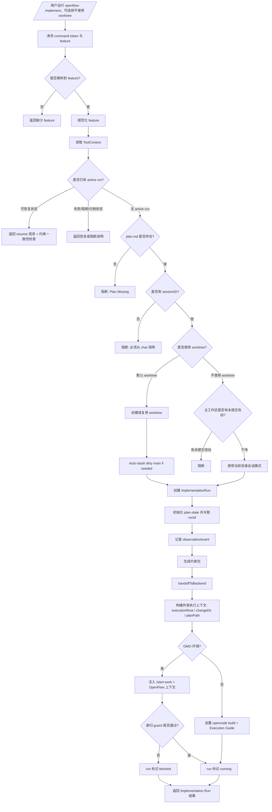

# Implement 工作节点工作流

## 1. 节点定位

`implement` 是受治理的实现启动节点。代码入口是 `src/commands/implement.ts` 的 `handleImplement`，后端分流在 `src/utils/implementation-backend.ts`。

这个节点的职责不是"让 AI 开始随便改代码"，而是创建或恢复 `ImplementationRun`，确定执行根目录，建立 worktree/session 隔离，并把完整实现上下文交给 OMO 或 OpenCode。

## 2. 流程图

```mermaid
flowchart TD
    A[/用户运行 openflow-implement，可选择不使用 worktree/] --> B[清洗 command token 与 feature]
    B --> C{是否解析到 feature?}
    C -->|否| Z[返回缺少 feature]
    C -->|是| D[规范化 feature]
    D --> E[读取 ToolContext]
    E --> F{是否已有 active run?}
    F -->|可恢复状态| G[返回 resume 信息 + 约束一致性检查]
    F -->|失败/阻断/归档状态| H[返回恢复或阻断说明]
    F -->|无 active run| I{plan.md 是否存在?}
    I -->|否| J[阻断: Plan Missing]
    I -->|是| K{是否有 sessionID?}
    K -->|否| L[阻断: 必须从 chat 调用]
    K -->|是| M{是否使用 worktree?}
    M -->|默认 worktree| N[创建或复用 worktree]
    M -->|不使用 worktree| O{主工作区是否有未提交改动?}
    O -->|有未提交改动| P[阻断]
    O -->|干净| Q[使用当前目录会话模式]
    N --> N1[Auto-stash dirty main if needed]
    N1 --> R[创建 ImplementationRun]
    Q --> R
    R --> R1[初始化 plan-state 并关联 runId]
    R1 --> S[记录 observation/event]
    S --> S1[生成约束包]
    S1 --> T[handoffToBackend]
    T --> T0[构建共享执行上下文: executionRoot / changeDir / planPath]
    T0 --> U{OMO 环境?}
    U -->|是| V[注入 /start-work + OpenFlow 上下文]
    U -->|否| W[设置 opencode build + Execution Guide]
    V --> X{递归 guard 是否通过?}
    X -->|否| Y[run 标记 blocked]
    X -->|是| Z1[run 标记 running]
    W --> Z1
    Y --> Z2[返回 Implementation Run 结果]
    Z1 --> Z2
```

## 3. 给人和 AI 执行的流程说明

1. 用户运行 `/openflow-implement <feature>`。
2. 系统先清洗输入：
   - 去掉 `/openflow-implement` 命令 token。
   - 保留真正的 feature 名。
3. 如果用户没有提供 feature：
   - 系统尝试查找 active feature。
4. 如果仍然没有 feature：
   - 返回错误。
   - 不创建 ImplementationRun。
   - 不创建 worktree。
   - 不交给任何后端执行。
5. 如果 feature 存在：
   - 系统清洗为安全 slug。
   - 读取 ToolContext 中的 `sessionID`、`messageID`、`agent`。
6. 系统查找已有 active ImplementationRun。
7. 如果已有 run 处于可恢复状态：
   - `created`。
   - `starting_backend`。
   - `running`。
   - `quality_gate_pending`。
   - `ready_for_archive`。
8. 对可恢复 run，系统只返回 resume 信息：
   - 不创建第二个 run。
   - 不创建第二个 worktree。
   - 不重复 handoff。
9. 如果 run 是 `running` 状态的恢复：
   - 系统检查已有约束文件的一致性：比较 `plan.md` 和 `constraints.md` 的 mtime。
   - 如果 plan.md 比 constraints.md 更新，记录 "constraints are stale" observation，跳过复用。
   - 如果约束仍然有效，记录 "reusing existing constraints" observation。
10. 如果 run 是 `quality_gate_pending`：
   - 返回提示：运行 `openflow-quality-gate`。
11. 如果 run 是 `ready_for_archive`：
   - 返回提示：运行 `/openflow-archive`。
12. 如果已有 run 是 `failed` 或 `cancelled`：
   - 返回 recovery required。
   - 要求用户先清理或处理失败 run。
13. 如果已有 run 是 `blocked`：
   - 返回 blocked run exists。
   - 不启动新实现。
14. 如果已有 run 是 `archived`：
   - 返回 already archived。
   - 新一轮变更应重新从 `/openflow-feature` 开始。
15. 如果没有 active run，系统检查 `plan.md` 是否存在。
16. 如果 `plan.md` 不存在：
   - 返回 Plan Missing 错误（通过 `formatPlanMissingMessage` 格式化）。
   - 提示先运行 `/openflow-plan <feature>`。
   - 不创建 run。
17. 如果没有 `sessionID`：
   - 阻断创建。
   - 要求从 chat 输入 `/openflow-implement <feature>`。
   - 不允许作为无上下文工具调用绕过。
18. 如果有 `sessionID`，系统决定执行容器模式。
19. 默认模式是 worktree：
   - `useWorktree = true`。
   - `containerMode = worktree`。
20. 如果用户显式使用 `--no-worktree`：
   - `useWorktree = false`。
   - `containerMode = session`。
21. 如果用户使用 `--no-worktree` 且主工作区 dirty：
   - 系统阻断。
   - 提示使用默认 worktree，或先 commit/stash。
   - 不在 dirty main 上直接实现。
22. 如果使用 worktree：
     - 系统创建或复用 worktree。
     - 记录 branch 与 baseRef。
     - 如果主工作区 dirty，系统自动执行 `git stash --include-untracked`，创建 worktree 后在 finally 中执行 `git stash pop` 恢复。stash 失败不阻断 worktree 创建（降级处理）；pop 失败记录 warning observation 但不抛异常（用户需手动 `git stash pop`）。
23. 如果 worktree 创建失败：
   - 返回 Worktree Creation Failed。
   - 不静默回退到主工作区。
24. 系统创建 ImplementationRun。
25. ImplementationRun 必须记录：
   - feature。
   - runID。
   - sessionID。
   - messageID。
   - agent。
   - directory。
   - worktree（如有）。
   - branch / baseRef（如有）。
   - backend。
   - backendCommand。
   - status。
   - containerMode。
   - eventsPath。
   - observationsPath。
   - mainWorktreeDirty。
26. 系统把 run 写入 store。
27. 系统初始化 plan 执行状态（`initPlanState`）并关联 runId：
   - 设置 `planState.runId = run.runID`。
   - 设置 `planState.status = 'in_progress'`。
   - 通过 `savePlanState` 持久化。
   - 初始化失败不阻断 run 创建（只记录 warning log）。
28. 系统记录 observation：
   - run 已创建。
   - worktree 是否创建。
   - backend/containerMode 信息。
29. 系统把 active run 写入 observer。
30. 系统生成约束包（`generateConstraintPacket`）：
   - 读取 plan.md 内容。
   - 根据 plan 内容生成约束。
   - 记录约束状态和数量的 observation。
   - 约束生成失败不阻断（只记录 warning）。
31. 系统调用 `handoffToBackend`。
32. `handoffToBackend` 先构建共享执行上下文：
   - `executionRoot = run.worktree || run.directory`。
   - `changeDir = await resolveChangeUnitDir(executionRoot, run.feature)`。
   - `planPath = docs/changes/${changeDir}/plan.md`。
   - 该上下文被 OMO 和 non-OMO 两个分支共用。
33. `handoffToBackend` 检测 OMO 环境。
     - OMO 检测路径：系统优先检查 `.omo/` 目录（`.omo/boulder.json`），然后检查 `.sisyphus/` 作为兼容 fallback。
34. 如果不是 OMO 环境：
     - backend 设置为 `opencode`。
     - backendCommand 设置为 `opencode build`。
     - run 状态设置为 `running`。
     - 记录 backend_started event。
     - 记录 implementation context observation。
     - 系统构建 Execution Guide（含 Execution Context、What To Do、Task Breakdown、Plan Progress Tracking、Critical Rules、条件 Constraints、条件 Worktree Completion），注入到 `handleImplement` 返回文本中。
     - Execution Guide 引用 `design.md` 和 `behavior.md` 路径，要求 AI 阅读后再执行。
     - Execution Guide 包含 Plan Progress Tracking 要求：AI 必须更新 plan.md checkbox（`- [ ]` → `- [x]`），quality gate 会检查未勾选项。
35. 如果是 OMO 环境：
   - 构造 `/start-work {feature}` 命令。
   - 附带 OpenFlow Implementation Context。
36. OMO handoff 上下文必须包含：
   - `runID`。
   - `feature`。
   - `executionRoot`。
   - `worktree`。
   - `planPath`。
   - `containerMode`。
   - `mustUseExistingImplementationRun: true`。
37. 如果当前 session 已有 handoff 在进行：
   - 递归 guard 阻断。
   - run 更新为 `blocked`。
   - 返回 handoff failed。
38. 如果 OMO prompt 发送成功：
     - run backend 更新为 `omo`。
     - run 状态更新为 `running`。
     - 记录 backend_started event。
39. Observer 统一推进规则（D6 方案 B）：
   - OMO 和 non-OMO 后端完成后，observer 的 `toolAfterHook` 都将 run status 推进到 `quality_gate_pending`。
   - 不区分后端类型，统一状态转换。
40. 如果 OMO prompt 发送失败：
   - run 状态更新为 `blocked`。
   - 记录 backend_failed event。
   - 返回错误信息。
41. `handleImplement` 返回 Implementation Run Created 或对应阻断/恢复报告。
42. 实现代理收到 handoff 后，必须按计划执行。
43. 如果任务涉及核心业务逻辑：
   - 必须执行 TDD。
   - 先写失败测试，再写最小实现，再重构。
44. 如果任务涉及 `behavior.md` 场景：
   - 必须补充集成测试或等价行为证据。
   - 行为证据要能映射到 scenario。
45. 实现完成后：
   - 实现代理必须调用 `openflow-quality-gate`。
   - 不允许在 quality-gate 返回 readiness 前声称完成。

## 4. OMO 与 OpenCode 分流规则

1. 分流由代码检测，不由 AI 猜测。
2. OMO 环境下：
     - OpenFlow 不替代 OMO。
     - OpenFlow 只把 ImplementationRun 上下文注入 `/start-work`。
     - OMO 后续执行仍应使用同一个 run。
     - 检测路径：`.omo/` 优先，`.sisyphus/` 兼容 fallback。涵盖 boulder.json（active_plan）、目录 marker entries（boulder.json, plans, run-continuation）、opencode config 插件列表。
3. 非 OMO 环境下：
     - 使用 OpenCode 原生 build 流程。
     - 仍保留 ImplementationRun。
     - 后续 quality-gate/archive 仍绑定该 run。
     - non-OMO 路径返回 Execution Guide 注入到结果文本中，引导 AI 按 plan 执行并调用 quality-gate。
4. 两条路径都必须回到同一个质量门：
   - 实现完成后调用 `openflow-quality-gate`。
   - Ready 后再由用户确认 archive。
5. Observer 状态推进统一：
   - OMO 和 non-OMO 后端完成后，observer 都将 run 推进到 `quality_gate_pending`。
   - 不存在"non-OMO 保持 running"的分支。

## 5. 产物

1. 必须产生：
   - ImplementationRun 记录。
   - feature-scoped event log。
   - feature-scoped observation log。
   - plan-state.json（关联 runId，非阻断性）。
2. 默认可能产生：
   - 派生 worktree。
   - feature branch。
   - constraints.md 约束包。
3. 不直接产生：
   - `design.md`。
   - `plan.md`。
   - `implementation-mapper.md`。
   - archive 目录。

## 6. 禁止事项

1. 不要绕过 `/openflow-implement` 直接从 plan 开始改代码。
2. 不要在没有 sessionID 的工具调用里创建 run。
3. 不要在 plan.md 不存在时创建 run。
4. 不要在 dirty main 上使用 `--no-worktree`。
5. 不要在 worktree 创建失败时静默回退到主工作区。
6. 不要重复创建 active run。
7. 不要丢失 runID、executionRoot、worktree、planPath 等 handoff 上下文。
8. 不要实现完成后跳过 `openflow-quality-gate`。
9. 不要在 worktree 创建失败时丢弃 auto-stash。pop 必须在 finally 中执行。
10. 不要复用过期约束：resume 时如果 plan.md 比 constraints.md 更新，应跳过约束复用。

## 7. 与代码对照清单

| 文档规则 | 代码依据 | 漂移检查 |
|---|---|---|
| 入口创建/恢复 run | `src/commands/implement.ts` | `handleImplement()` 仍处理 resumeStatuses |
| 默认 worktree | `effectiveUseWorktree = useWorktree ?? true` | 默认值未改为 false |
| dirty main 阻断 | `isMainWorktreeDirty()` 分支 | 只在 `--no-worktree` 时阻断 |
| plan.md 前置检查 | `handleImplement()` 步骤 3b | 通过 `formatPlanMissingMessage()` 返回 |
| ImplementationRun 字段 | `implementationRunStore.createRun()` | 字段仍包含 backend/containerMode/events/observations |
| plan-state 关联 | `initPlanState()` + `savePlanState()` | runId 关联在 run 创建后执行 |
| 约束包生成 | `generateConstraintPacket()` | 约束生成失败不阻断 |
| 约束一致性检查 | resume 路径 mtime 比较 | plan.md 更新后跳过 constraints.md 复用 |
| OMO 检测 | `detectOmoEnvironment()` | `.omo` 优先 + `.sisyphus` 兼容 fallback |
| 共享执行上下文 | `handoffToBackend()` 分支前 | `executionRoot/changeDir/planPath` 两个分支共用 |
| 非 OMO 命令 | `implementation-backend.ts` | command 仍是 `opencode build` |
| Execution Guide | `buildExecutionGuide()` | 含 design.md/behavior.md 引用 + Plan Progress Tracking |
| OMO handoff | `handoffToBackend()` | prompt 仍包含 `/start-work` 和完整 OpenFlow context |
| 递归 guard | `activeHandoffs` | 同 session handoff 仍被阻断 |
| Observer 统一推进 | `implementation-observer.ts` | OMO/non-OMO 都推进到 `quality_gate_pending` |

## 8. 漂移风险提示

如果 ImplementationRun 状态机、worktree 默认策略、dirty-main 策略、plan.md 前置检查、plan-state 关联、约束一致性检查、OMO 检测、handoff prompt 字段、Observer 状态推进规则或 archive root 匹配规则变化，本文件必须同步更新。重点检查 `src/commands/implement.ts`、`src/utils/implementation-backend.ts`、`src/utils/implementation-worktree.ts`、`src/utils/plan-state.ts`、`src/hooks/implementation-observer.ts`、`src/hooks/implementation-guard.ts`。
