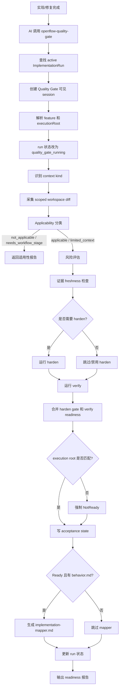
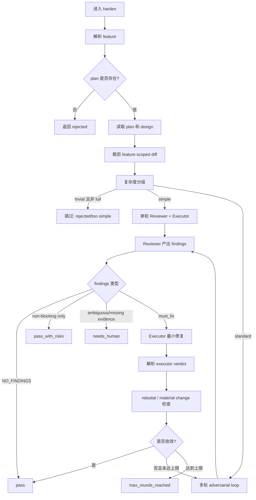

# Quality-gate 工作节点工作流

## 1. 节点定位

`quality-gate` 是实现完成后的质量门节点。代码入口是 `src/skills/quality-gate-skill.ts` 注册的 `openflow-quality-gate` Skill，内部编排在 `src/commands/quality-gate.ts`。

这个节点不是普通用户 slash command。它是 AI 在实现代码或修复 bug 后必须调用的后置验证流程。它负责判断是否需要 harden、运行 evidence-aware verify、写入 acceptance state，并给出 readiness。

## 2. 给人看的流程图

## 3. 给人和 AI 执行的流程说明

1. AI 完成实现、测试修改、bug fix 或实现评审修复。
2. AI 必须调用 `openflow-quality-gate`。
3. AI 在调用前不能声称：
   - 功能完成。
   - 验证通过。
   - 可以归档。
4. quality-gate 查找 active ImplementationRun。
5. 如果找到 active run：
   - 使用 run 的 feature。
   - 使用 run 的 sessionID。
   - 使用 run 的 executionRoot。
   - 将 run 状态更新为 `quality_gate_running`。
6. 如果没有 active run：
   - 尝试从参数、active feature、acceptance state 解析 feature。
   - 使用当前项目目录作为执行根。
7. quality-gate 创建可见 Quality Gate session。
8. Quality Gate session 记录阶段进度：
   - context/scope。
   - applicability。
   - risk。
   - harden decision。
   - harden round summary。
   - verify summary。
   - readiness。
9. 系统识别 context kind。
10. context kind 可能是：
   - `feature`：有正式 feature 设计上下文。
   - `issue`：有 issue clarification 上下文。
   - `plan`：有 plan 上下文。
   - `limited`：有代码/test 改动，但语义上下文有限。
   - `none`：没有可用语义上下文。
11. 系统采集 workspace 状态：
   - git diff。
   - untracked files。
   - feature scope 内文件。
   - omitted files。
12. 系统执行 Applicability 分类。
13. 如果分类是 `not_applicable`：
   - 返回适用性报告。
   - 不运行 harden。
   - 不运行 verify。
   - 如果绑定 run，run 会被记录为 blocked/NotReady 路径。
14. 如果分类是 `needs_workflow_stage`：
   - 返回需要进入显式工作流阶段的提示。
   - 不要为了让 gate 通过而伪造 design/plan/behavior。
15. 如果分类是 `limited_context`：
   - 可以继续做技术验证。
   - 结果不能自动等同于完整 feature 语义 readiness。
   - 不能直接当作常规 archive 资格。
16. 如果分类是 `applicable`：
   - 继续风险评估。
17. 风险评估检查：
   - 变更文件数量。
   - diff 行数。
   - 是否新增 export。
   - 是否跨模块或复杂变更。
   - diff 内容复杂度。
18. 系统判断是否需要 harden。
19. 如果不需要 harden：
   - hardenStatus 标记为 `skipped`。
   - 继续 verify。
20. 如果 harden 配置禁用：
   - hardenStatus 标记为 `disabled`。
   - 继续 verify。
21. 如果需要 harden 且配置启用：
   - 运行内部 `handleHarden`。
   - 记录 harden 输出和状态。
22. 系统检查 evidence freshness。
23. 如果已有 verify evidence 是 fresh：
   - 可以复用 acceptance state 中的 verifyResult。
24. 如果 evidence missing 或 stale：
   - 重新运行 verify。
25. verify 收集证据。
26. verify 检查：
   - active feature resolution。
   - plan 是否存在。
   - change workspace 是否存在。
   - design 或 issue clarification 是否存在。
   - `behavior.md` 是否存在。
   - `docs/current` 与 `docs/decisions` baseline。
   - security adapters。
   - consistency adapters。
   - compilation probe。
   - behavior scenario evidence。
27. verify 生成 Evidence packet。
28. Evidence packet 包括：
   - checks_run。
   - check_results。
   - observed_behavior_summary。
   - intended_vs_actual_delta。
   - doc_alignment_summary。
   - current_decisions_conflict_summary。
   - known_risks_or_missing_evidence。
29. quality-gate 合并 harden 与 verify 结果。
30. 如果 harden 有 unresolved must-fix：
   - readiness 不能是 Ready。
31. 如果 harden 有 unresolved needs-decision：
   - readiness 不能是 Ready。
32. 如果 verify 返回 NotReady：
   - readiness 是 NotReady。
33. 如果 verify 返回 NeedsDecision：
   - readiness 是 NeedsDecision。
34. 如果 verify 返回 ReadyWithDocUpdates，且 harden 没有阻断：
   - readiness 是 ReadyWithDocUpdates。
35. 如果 verify 返回 Ready，且 harden 没有阻断：
   - readiness 是 Ready。
36. 如果绑定了 ImplementationRun，系统检查 execution root。
37. 如果当前 execution root 和 run 记录不一致：
   - readiness 强制改为 NotReady。
   - 不允许进入 `ready_for_archive`。
38. 系统写 acceptance state。
39. 如果 readiness 是 Ready 或 ReadyWithDocUpdates：
   - implementation state 标记为 verified。
40. 如果 readiness 是 NotReady 或 NeedsDecision：
   - implementation state 标记为 blocked。
41. 如果 readiness 是 Ready 或 ReadyWithDocUpdates，且存在 `behavior.md`：
   - 生成 `implementation-mapper.md`。
   - mapper 记录 behavior scenario 与代码文件的映射。
42. 系统更新 ImplementationRun 状态。
43. Ready / ReadyWithDocUpdates 通常映射为 `ready_for_archive`。
44. NotReady / NeedsDecision 映射为 blocked。
45. 系统输出 readiness 报告。
46. 如果报告是 NotReady：
   - AI 必须修复阻断问题。
   - 修复后重新运行 quality-gate。
47. 如果报告是 NeedsDecision：
   - AI 必须请求或记录业务/设计决策。
   - 决策完成后重新运行 quality-gate。
48. 如果报告是 ReadyWithDocUpdates：
   - 可以进入 archive，但 archive 可能要求确认 doc updates。
49. 如果报告是 Ready：
   - 可以等待用户确认 `/openflow-archive <feature>`。
50. quality-gate 不会自动归档。

## 4. Harden 加固详细流程

1. harden 只在 quality-gate 风险判断需要时运行。
2. harden 读取 `.sisyphus/plans/{feature}.md`。
3. 如果 plan 不存在：
   - harden 返回 rejected。
   - quality-gate 不能把它解释为加固通过。
4. harden 读取 design 文档作为契约上下文。
5. harden 裁剪 feature-scoped diff。
6. 如果 `--full` 未启用：
   - 只评估与 feature 相关的 diff。
7. Reviewer 的契约优先级是：
   - decisions。
   - current。
   - behavior。
   - design。
   - plan。
   - request。
   - diff。
   - implementation。
8. Reviewer 只能判断实现是否符合契约。
9. Reviewer 不能提出新功能。
10. Reviewer 不能把实现驱动的契约变化当成自动通过。
11. finding 类型包括：
   - `behavior_violation`。
   - `intent_gap`。
   - `contract_divergence`。
   - `regression_risk`。
   - `missing_evidence`。
   - 兼容旧名：`blocking_bug`、`spec_violation`、`test_gap`、`design_ambiguity`。
12. 只有 executor-fixable 的 `must_fix` finding 会交给 Executor。
13. Executor 只能修实现问题。
14. Executor 不能改文档来解决契约分歧。
15. Executor 不能批准 contract divergence。
16. 如果 same finding 重复且没有 material change：
   - harden 停止并返回 review_inconclusive。
17. 如果达到最大轮数仍不收敛：
   - harden 返回 max_rounds_reached。
18. harden 输出会进入 acceptance state 的 harden summary。

## 5. BDD + 集成测试证据规则

1. `behavior.md` 是行为证据的主要契约来源。
2. verify 会解析可用行为场景。
3. 对 critical scenario：
   - 必须有 fresh evidence。
   - evidence 必须是 exact 或 equivalent。
   - partial / missing / stale 会形成阻断 evidence gap。
4. 对 optional scenario：
   - 缺失通常是 advisory。
   - 但如果被标记为 blocking，也会影响 readiness。
5. 集成测试可以作为 behavior evidence。
6. 集成测试必须证明用户可见行为，而不是只证明内部函数被调用。
7. Evidence 应能回溯到具体 scenario id 或 scenario 名称。
8. verify 会在 observed behavior summary 中汇总 scenario coverage。

## 6. 实现期测试与 quality-gate 的边界

1. 实现代理负责运行代码级检查：
   - LSP diagnostics。
   - typecheck。
   - lint。
   - test。
   - build。
2. quality-gate 不应盲目重复所有实现期检查。
3. quality-gate 重点是：
   - 证据链完整性。
   - 语义对齐。
   - 行为场景覆盖。
   - 风险驱动 harden。
   - archive readiness。

## 7. 产物

1. acceptance state 更新。
2. verify result。
3. evidence freshness metadata。
4. harden summary（如运行 harden）。
5. Quality Gate session 进度记录。
6. ImplementationRun 状态更新。
7. `docs/changes/{feature}/implementation-mapper.md`（Ready/ReadyWithDocUpdates 且存在 behavior.md 时）。

## 8. 禁止事项

1. 不要跳过 quality-gate 后声称实现完成。
2. 不要让用户手动运行 `/openflow-harden` 或 `/openflow-verify` 作为正常路径。
3. 不要为了让 quality-gate 通过而伪造 design/plan/behavior。
4. 不要把 limited-context 技术验证当成完整 feature readiness。
5. 不要在 Ready 后自动 archive。
6. 不要忽略 execution root mismatch。
7. 不要把 harden 的 needs_human / unresolved finding 当作通过。

## 9. 与代码对照清单

| 文档规则 | 代码依据 | 漂移检查 |
|---|---|---|
| Skill 入口 | `src/skills/quality-gate-skill.ts` | `openflow-quality-gate` 仍是 Skill |
| 编排入口 | `src/commands/quality-gate.ts` | `handleQualityGate()` 仍解析 run/context/applicability |
| active run 绑定 | `findActiveImplementationRun()` | 仍优先绑定 run |
| context kind | `resolveContextKind()` | feature/issue/plan/limited/none 语义未变 |
| applicability | `classifyQualityGateApplicability()` | NotApplicable/NeedsWorkflowStage/LimitedContext 规则未漂移 |
| risk harden | `decideQualityGateRisk()` + `handleHarden()` | 风险触发 harden 仍存在 |
| verify | `handleVerify()` | Evidence packet 字段未漂移 |
| root mismatch | `checkExecutionRootMismatch()` | mismatch 仍强制 NotReady |
| mapper | `generateBehaviorCodeMapper()` | Ready 且 behavior.md 存在时仍写 mapper |

## 10. 漂移风险提示

如果 quality-gate 的 applicability 状态、risk 规则、harden status、verify readiness、behavior evidence 格式、ImplementationRun 状态映射或 mapper 生成条件变化，本文件必须同步更新。重点检查 `src/commands/quality-gate.ts`、`src/commands/harden.ts`、`src/commands/verify.ts`、`src/skills/quality-gate-skill.ts`。
