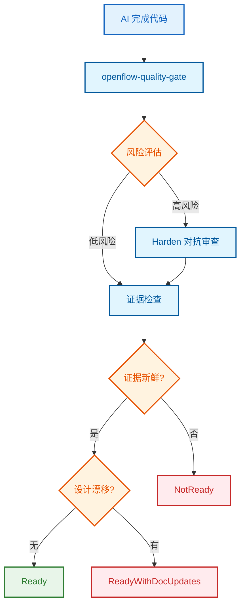
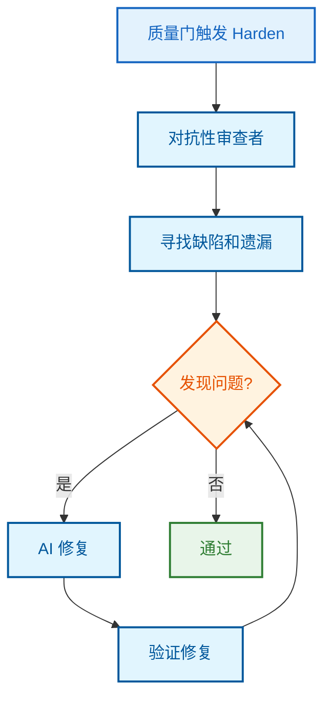

# 架构图解

这组图解释 OpenFlow 官网最需要被快速看懂的六个机制：主工作流、实施后端、质量门、harden 对抗、BDD/集成测试证据、归档追溯。

## 1. 工作流流程图


## 2. `/openflow-implement` 工作原理

```mermaid
flowchart TD
    start[/openflow-implement] --> detect{检测 OMO}
    detect -->|已安装| omo[OMO /start-work]
    detect -->|未安装| native[OpenCode 原生执行]
    omo --> worktree[工作树隔离]
    native --> worktree
    worktree --> execute[代码实现]

    classDef entry fill:#e3f2fd,stroke:#1565c0,stroke-width:2px,color:#1565c0
    classDef decision fill:#fff3e0,stroke:#e65100,stroke-width:2px,color:#e65100
    classDef process fill:#e1f5fe,stroke:#01579b,stroke-width:2px,color:#01579b
    classDef result fill:#e8f5e9,stroke:#2e7d32,stroke-width:2px,color:#2e7d32

    class start entry
    class detect decision
    class omo,native,worktree process
    class execute result
```

## 3. 质量门执行原理



## 4. harden 对抗



## 5. BDD 指导集成测试


## 6. 归档工作原理

```mermaid
flowchart TD
    archive[/openflow-archive] --> freeze[冻结 changes → archive]
    freeze --> promote[提升 current 事实]
    promote --> mapper[生成 implementation-mapper.md]

    classDef entry fill:#e3f2fd,stroke:#1565c0,stroke-width:2px,color:#1565c0
    classDef process fill:#e1f5fe,stroke:#01579b,stroke-width:2px,color:#01579b
    classDef result fill:#e8f5e9,stroke:#2e7d32,stroke-width:2px,color:#2e7d32

    class archive entry
    class freeze,promote process
    class mapper result
```
