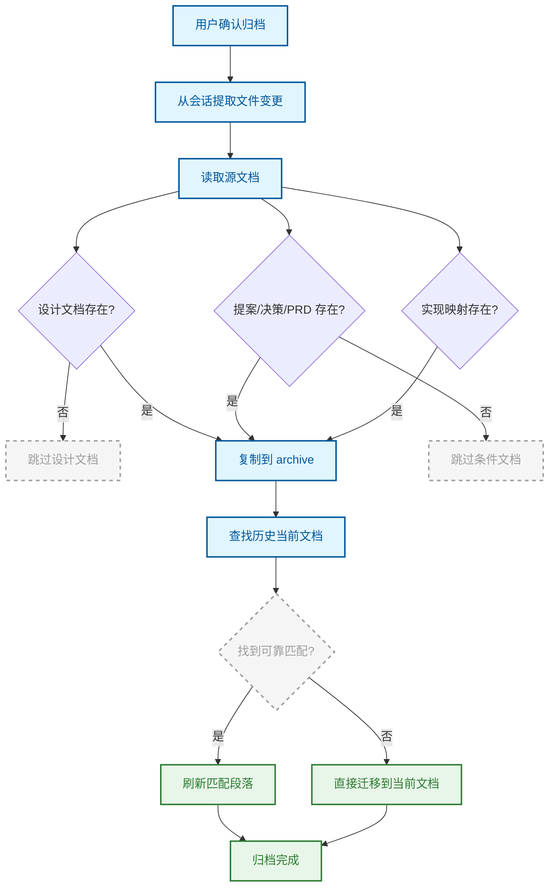

# 归档

将已验证的特性冻结为历史记录，并更新当前文档。

## 原理

归档节点解决的核心问题是：**如何安全地将完成的工作从活跃工作区转移到历史档案，同时保持项目文档的持续更新**。

归档不是一个简单的文件复制操作。它需要识别哪些文档属于这个特性、从会话中提取实际变更的文件列表、将文档冻结到 `docs/archive/` 目录，并将关键信息提升（promote）到 `docs/current/` 中的活跃文档。

## 流程

归档从会话 API 中检索所有文件变更，提取 write/edit 操作对应的文件列表。然后从 `docs/changes/` 工作区读取源文档，复制到 `docs/archive/YYYY-MM-DD-feature/` 目录。最后，通过标题和内容的 token 重叠匹配，更新 `docs/current/` 中的活跃文档。

## 关键概念

### 冻结

源文档被复制到 `docs/archive/YYYY-MM-DD-feature/` 目录，按原样保存。这不是移动而是复制——原始工作区文件仍然存在。归档目录中的文档是只读的历史记录，代表特性完成时的确切状态。

### 提升（Promote）

归档过程中，系统自动将关键信息提升到当前活跃文档。它通过 Markdown 标题和正文的 token 重叠匹配，在 `docs/current/` 中找到同一功能区域的历史文档，然后用归档文档中的匹配段落替换对应内容，同时保留不相关的历史段落。当找不到可靠匹配时，回退到直接迁移。

### 条件文档

不是所有文档都会归档。`design.md` 是主要文档，始终归档。其他文档（`proposal.md`、`decisions.md`、`prd.md`、`plan.md`、`implementation-mapper.md`）只有在存在时才归档。系统不会因为缺少某个文档而失败。

### 实现映射

如果质量门阶段生成了 `implementation-mapper.md`（记录行为场景与对应代码文件的追踪关系），它也会被复制到归档目录中，保持行为到代码的完整可追溯性。

## 与其他节点的关系

[质量门](./quality-gate.md) → **本节点** — 质量门确认就绪后，归档需要用户显式确认才会执行

## 来源

- `src/skills/archive-skill.ts`
