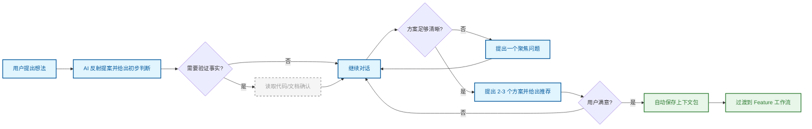

# 头脑风暴

在进入正式工作流之前，通过自由对话探索问题空间、比较方案、理清意图。

## 原理

头脑风暴节点是一个纯对话式工作阶段。它不做任何文档生成、状态管理或工作流强制执行——只帮助用户在提交到结构化 Feature 工作流之前，把想法理清楚。

它解决的核心问题是：**过早进入形式化流程会导致设计方向偏移**。通过先进行低成本的对话探索，用户可以在不产生任何正式文档的情况下，理解需求边界、比较方案优劣、识别潜在风险。

## 流程

对话从一个反射开始：AI 先总结用户的提案并给出初步判断。后续每一步只问一个问题，避免信息过载。当理解充分时，AI 会提出 2-3 个具体方案，附带明确的推荐和权衡分析。

上下文包在对话过程中被自动提取和保存到 `.openflow/brainstorm/context-packets/`，无需用户手动操作。

## 关键概念

### 渐进式聚焦

不是一开始就列出完整问卷，而是每次只问一个问题，用户的回答自然引出下一个问题。偏好选择题而非开放式提问，保持对话焦点。

### 上下文自动保存

随着对话推进，稳定的信息（问题、决策、约束、非目标）被静默提取为上下文包。当用户过渡到 Feature 工作流时，这些上下文会被自动拾取，无需重新输入。

### 范围控制

如果想法过大，AI 会主动帮助分解为多个独立有价值的小块。遵循 YAGNI 原则——移除当前不需要的任何内容。

### 边界

头脑风暴**不生成**设计文档、行为规范或开发计划。它只是一个准备阶段，为后续的 Feature 工作流提供更清晰的意图和已保存的上下文。

## 与其他节点的关系

→ 本节点是工作流的起点（可选）
→ [Feature](./feature.md) — 头脑风暴完成后，可过渡到 Feature 设计阶段

## 来源

- `src/skills/brainstorm-skill.ts`
- `.openflow/brainstorm/context-packets/`
