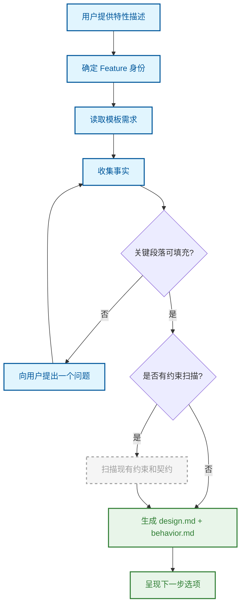

# Feature（特性设计）

将模糊的想法收敛为结构化的设计文档和行为约束。

## 原理

Feature 节点是工作流中第一个产生正式文档的阶段。它通过自由对话收集事实，然后从中推导出设计约束、目标、非目标和验收标准，最终生成 `design.md` 和 `behavior.md`。

它解决的核心问题是：**从非结构化的意图到可验证的设计契约**。不是让 AI 猜测需求，而是通过对话逐步填充设计空间中的空白，确保每个决策都有依据。

## 流程

Feature 身份从用户的自然语言描述中确定性推导——相同的描述始终产生相同的 slug。事实以自由形式的键值对收集（如 `problem`、`scope`、`constraints`），不使用固定模板。当 AI 判断上下文足以填充所有模板段落时，自动触发生成。

## 关键概念

### 事实收集

使用自由形式的键值对记录用户输入，而非固定问卷。AI 根据当前已收集的信息判断还需要什么，每次只问一个问题。支持纠正和删除已收集的事实。

### 就绪判断

没有固定的"足够了"阈值。AI 比较已收集的事实与模板段落需求：如果段落可以从用户的自然语言描述中有意义地填充，即使没有显式的键名，也视为充分。一旦充分，立即停止提问并生成。

### 约束与契约扫描

Feature 阶段会扫描项目中已有的约束——来自 `docs/current/` 下的约束段落、`docs/decisions/` 下的架构决策记录（ADR），以及 AI 反思文档。这些约束通过路径匹配（精确、前缀、glob、关键词）关联到当前特性，确保设计不与既有规则冲突。

### 设计输出

生成 `design.md`（问题、目标、设计约束、方案）和 `behavior.md`（行为规范、验收标准、边界条件）。这些文档位于 `docs/changes/YYYY-MM-DD-{feature}/` 工作区中。

## 与其他节点的关系

[头脑风暴](./brainstorm.md) → **本节点** → [开发计划](./writing-plan.md)

## 来源

- `src/skills/feature-skill.ts`
- `src/contracts/context-resolver.ts`
- `src/contracts/constraint-scanner.ts`
