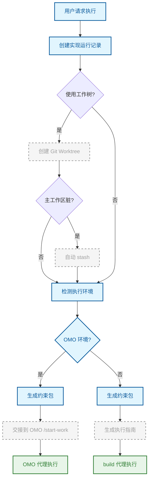

# 执行

在隔离环境中将开发计划转化为代码实现。

## 原理

执行节点解决的核心问题是：**如何安全地、可追溯地将计划落地为代码**。它通过多后端路由、工作树隔离和结构化执行指南，确保实现过程既不污染主分支，又能在正确的执行环境中运行。

执行节点不决定做什么（那是计划的事），而是决定**在哪里做、由谁做、如何追踪**。

## 流程

系统首先创建实现运行记录（ImplementationRun），记录运行 ID、特性名称和执行上下文。然后根据配置决定是否使用工作树隔离，最后通过 OMO 检测确定执行后端。

## 关键概念

### 多后端执行

系统自动检测运行环境。OMO 环境下，通过 `/start-work` 命令交接给 OMO 的 Prometheus 代理，利用其面试、审批和执行能力。非 OMO 环境下，交接给 OpenCode 原生 build 代理，由结构化执行指南驱动。

### 工作树隔离

执行可以在独立的 Git Worktree 中进行，创建 `openflow/implement-{feature}` 分支。这确保实现过程完全隔离于主分支——主分支的脏状态会被自动 stash 并在操作完成后恢复。工作树在归档阶段合并回主分支。

### OMO 检测

系统通过多层规则检测 OMO 环境：检查 `/start-work` 命令、`.omo/boulder.json` 或 `.sisyphus/boulder.json` 中的 `active_plan`、目录中的 OMO 标记文件、以及 opencode 配置中的 OMO 插件。检测结果是确定性的——同一个环境始终路由到同一个后端。

### 约束包注入

执行交接前，系统从当前文档、架构决策和 AI 反思中解析约束，生成约束包（`constraints.md`），注入到执行上下文中。每个约束通过精确/前缀/glob/关键词匹配关联到计划中的文件路径。

## 与其他节点的关系

[开发计划](./writing-plan.md) → **本节点** → [质量门](./quality-gate.md)

## 来源

- `src/utils/implementation-backend.ts`
- `src/utils/agent-router.ts`
- `src/utils/implementation-worktree.ts`
- `src/utils/omo-detection.ts`
