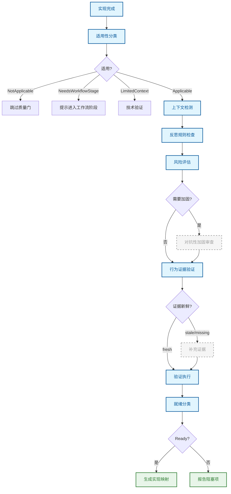

# 质量门

实现完成后的最终技术验证权威。

## 原理

质量门解决的核心问题是：**如何确认代码变更真正完成了它应该做的事**。它不是用户命令，而是 AI 在实现完成后必须调用的内部验证机制。

质量门不接受"看起来没问题"的主观判断。它通过适用性分类、风险评估、对抗性加固、证据验证和就绪分类五个阶段，产出机器可读的就绪状态。

## 流程

质量门首先判断当前工作是否需要经过完整验证（纯设计、纯规划、纯文档工作不需要）。对于适用的工作，它逐步验证上下文、风险、证据和一致性。

## 关键概念

### 证据门控

质量门不接受自然语言声明（如"测试通过了"）作为证据。它要求行为证据文件（`.sisyphus/evidence/`）包含可执行快照——包括 git HEAD、变更文件列表、时间戳和 diff 哈希。通过对比存储的快照与当前工作区状态，判断证据是否仍然有效。

### 风险评估

风险决策基于多维信号：变更文件数（≥3 个为高风险）、diff 行数（≥50 行为高风险）、是否有新公开 API 导出、是否涉及敏感路径（安全、认证、支付等）、是否包含有状态逻辑、是否有生产数据风险，以及 diff 复杂度分级。任何高风险触发器都会启用对抗性加固。

### 证据新鲜度

证据不是一次性有效的。系统通过 git HEAD 比对、变更文件集合比对、diff 哈希比对和时间戳比对四个维度，判断存储的证据是否仍然匹配当前工作区状态。如果工作区在证据记录后发生了变更，证据被标记为 `stale`，需要重新收集。

### 对抗性加固

高风险变更会触发加固审查——一个对抗性的审查过程，按契约优先级（决策 > 当前文档 > 行为规范 > 设计 > 计划 > 实现）评判实现是否偏离。发现分类包括行为违规、规格违规、意图偏差、契约分歧、回归风险和证据缺失。

## 与其他节点的关系

[执行](./implement.md) → **本节点** → [归档](./archive.md)

## 来源

- `src/skills/quality-gate-skill.ts`
- `src/utils/risk-assessment.ts`
- `src/utils/evidence-freshness.ts`
