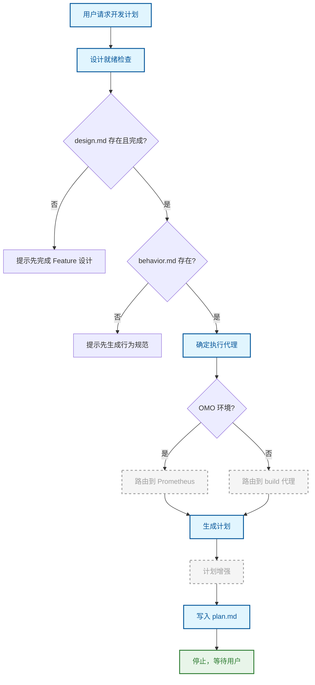

# 开发计划

将设计文档转化为可执行的、结构化的任务分解。

## 原理

开发计划节点的核心原则是：**计划中的每一行都必须能直接复制粘贴到任务执行中**。如果一个句子需要执行者重写，那它就不应该出现在计划里。

计划不是设计文档、不是需求规格，也不是意图的散文总结。它是一个结构化的、可追溯的任务树，具有清晰的边界、依赖关系和验证命令。

## 流程

计划生成前必须通过设计就绪检查——确认 `design.md` 和 `behavior.md` 都已存在。之后根据环境选择代理：OMO 环境路由到 Prometheus，非 OMO 环境路由到 OpenCode 原生 build 代理。计划生成后，增强器会自动注入设计上下文、验证检查和预算警告。

## 关键概念

### 计划结构

每个计划严格包含六个顶层段落：标题、概览、设计上下文、策略（金字塔/模式/混合/直接分解）、执行策略（并行波次和依赖矩阵）、任务列表。不多不少，保持一致性。

### 任务分解规则

任务按依赖深度分组为执行波次，同波次内的任务可以并行执行。每个任务必须是独立可交付的工作包，包含明确的文件路径、验证命令和代理配置。任务数与特性规模成比例：小型 3-5 个，中型 6-9 个，大型 10-15 个。

### 约束传递

设计阶段建立的约束（`[HIGH / security]` 等）必须跟随每一个受影响的任务。计划生成时会重新读取 `design.md` 和 `behavior.md`，确保约束不丢失。

### 代理路由

OMO 环境下，计划通过硬链接 `.sisyphus/plans/{feature}.md` → `docs/changes/.../plan.md` 共享，Prometheus 直接写入规范路径。非 OMO 环境下，build 代理生成计划后立即停止，STOP 护栏防止它继续执行实现。

## 与其他节点的关系

[Feature](./feature.md) → **本节点** → [执行](./implement.md)

## 来源

- `src/skills/writing-plan-skill.ts`
- `src/plan/parser.ts`
- `src/plan/enhancer.ts`
