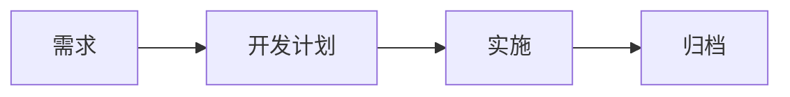

---
layout: doc
---

# OpenFlow 是什么

OpenFlow 是运行在 OpenCode 上的 AI 开发治理层：它不替 AI 写代码，而是约束 AI **应该改什么、不能改什么、凭什么说已经完成**。

## 一句话说清楚

**OpenFlow 把需求澄清、设计边界、实施计划、质量证据和归档追溯串成一条可审查的 AI 开发工作流。**

## 为什么需要它

AI 已经足够会写代码，但在真实项目里，风险往往不在“写不出来”，而在“写得太随意”。OpenFlow 解决的是这类治理问题。

### 1. AI 改了不该改的东西

你让 AI 修一个按钮样式，它顺手重构了组件体系；你让它加一个字段，它顺手调整了数据库语义。问题不在 AI 没能力，而在它缺少明确边界。

OpenFlow 用 `docs/current/`、`docs/decisions/` 和 `docs/changes/` 定义长期事实、正式决策和本轮变更范围。AI 可以在边界内发挥，但越界就是违规。

### 2. AI 说做完了，但不可信

“我认为已经修复”不是工程证据。AI 声称跑过测试，也不等于测试真的通过、结果可复核。

OpenFlow 把完成声明改造成证据门控：lint、typecheck、test、风险评估、必要时的对抗性审查，以及明确的就绪分类共同决定是否可以归档。

### 3. 三个月后没人知道为什么

很多 AI 变更只留下 diff，不留下原因。等到三个月后再看，团队只知道“这里被改过”，却不知道当时的需求、约束、取舍和验证依据。

OpenFlow 把每次变更归档为冻结历史，并生成 `implementation-mapper.md`，把需求、设计、行为约束和代码位置对应起来，让代码拥有可追溯的“出生证明”。

### 4. 换 Agent 后知识全丢

AI 会话是短暂的。换窗口、换模型、换 Agent，之前的隐含上下文就消失了。

OpenFlow 让项目知识沉淀到文档结构中：`current` 保存当前事实，`decisions` 保存正式决策，`changes` 保存进行中的上下文，`archive` 保存冻结历史。知识不再依赖某一次对话。

## 一条主工作流

OpenFlow 把一次受治理的变更收敛为四个阶段：

| 阶段 | 入口 | 做什么 | 产物 |
|---|---|---|---|
| 需求 | `/openflow-feature` | 把模糊想法收敛为可验证的设计契约 | `design.md`、`behavior.md` |
| 开发计划 | `/openflow-writing-plan` | 把设计拆解为可执行的任务序列 | `plan.md` |
| 实施 | `/openflow-implement` | 在约束边界内执行代码变更，质量门自动验证 | 代码变更、验证证据、Readiness 判定 |
| 归档 | `/openflow-archive` | 冻结历史、提升当前事实、生成追溯映射 | `docs/archive/*`、更新后的 `docs/current/*` |

> 进入正式需求之前，可以用 `/openflow-brainstorm` 低成本探索想法和比较方案——它是可选的预热阶段，不产生正式文档。

它的核心节奏是：**先澄清，再设计；先有计划，再实施；先有证据，再宣布完成；先归档，再成为权威事实。**

## 核心设计原则

### 1. 先澄清边界

模糊问题不应该直接进入实现。OpenFlow 鼓励先通过 brainstorm 或只读调查判断问题性质：它是新需求、Bug、数据异常、配置漂移，还是语义未澄清？边界清楚后，再进入正式变更。

### 2. 证据即完成标准

完成不是一句话，而是一组可复核证据。OpenFlow 让质量门输出明确分类：可以归档、需要补文档、尚未准备好，或需要人工决策。

### 3. 归档即权威边界

归档不是清理文件，而是正式关闭变更：历史被冻结，长期事实被提升，需求到代码的映射被记录。归档之后，团队才有一个可引用的权威状态。

### 4. 文档即行为契约

OpenFlow 中的文档不是建议，而是 AI 行为边界。`current` 是必须遵守的事实，`changes` 是本轮允许修改的范围，`decisions` 是技术选择的约束，`archive` 是不可变历史。

## 工程哲学

### 苏格拉底式工程方法

OpenFlow 更接近一种苏格拉底式工程方法，而不是“快速生成代码”的工具：

1. 不急于生成代码，先把问题定义清楚。
2. 先画变更边界，明确哪些能改、哪些不能动。
3. 显式标记不可变约束，避免事实、语义和行为被静默改变。
4. 先定义什么算完成，再让 AI 开始实施。

大多数工具假设用户已经知道要构建什么；OpenFlow 承认真实工程里常见的状态是：用户描述的是一个症状，而这个症状可能对应 Bug、数据异常、环境故障、配置漂移或需求不清。

在边界清晰之前就写代码，只是在更快地把不确定性注入系统。

### 为什么文档必须是行为契约

传统项目里，文档与代码经常脱节：文档写完就被遗忘，代码持续变化，AI 也没有动力遵守文档里的约束。

OpenFlow 的解决方案是把文档变成行为契约：

- `docs/current/`：当前仍有效的事实、设计、规范和工作流约定。
- `docs/changes/`：进行中的变更边界。
- `docs/decisions/`：跨需求的正式架构决策。
- `docs/archive/`：已经完成并冻结的历史权威。

这样设计的原因很简单：AI 需要明确边界才能可靠工作。如果文档只是“参考”，AI 就会自行决定何时遵守、何时忽略；这不是治理。

### 为什么完成必须靠证据

AI 的完成声明天然不可靠。“我认为已经修好了” 不等于真的修好；“我跑过测试”也不等于结果可追溯。

OpenFlow 用质量门把声明变成证据：验证命令必须有结果，风险必须被评估，高风险变更需要更强审查，最后输出机器可读的就绪判定。不同复杂度的变更可以有不同强度的验证，避免低风险任务被拖慢，也避免高风险任务漏检。

### 为什么归档才算真正完成

在 AI 辅助开发中，“完成”可能意味着很多事：AI 说做完了、代码能跑了、测试通过了，或变更被正式记录了。OpenFlow 选择最后一种作为工程闭环。

因为没有归档，就没有权威历史。代码改完后如果不冻结上下文、不更新当前事实、不记录需求到代码的映射，下次团队仍然要重新推理“当时为什么这样改”。归档让完成变成可引用、可交接、可审计的状态。

### 为什么漂移检测要用检查点

代码与设计会漂移，但持续监控每一次文件保存成本太高，也会在中间状态产生大量误报。完全不检查又会让漂移积累。

OpenFlow 选择检查点式检测：设计阶段生成合约标记，实施计划中嵌入检查点任务，在里程碑节点运行语义检查。它不替代最终的质量门，而是在关键节点提醒“实现是否已经偏离设计”。

## 适合谁

- **维护棕地项目的独立开发者**：希望 AI 帮忙，但不希望项目知识随会话消失。
- **使用 AI Agent 的工程团队**：需要统一的需求澄清、实施证据和归档追溯机制。
- **开源项目维护者**：希望 AI 贡献不只是提交代码，还能留下设计记录和验证证据。
- **平台、架构和质量负责人**：更关心边界、可审查性、交接质量和长期知识治理。

## 下一步

- [快速开始 →](/介绍/quickstart)
- [核心概念 →](/介绍/concepts)
- [与竞品对比 →](/介绍/comparison)
